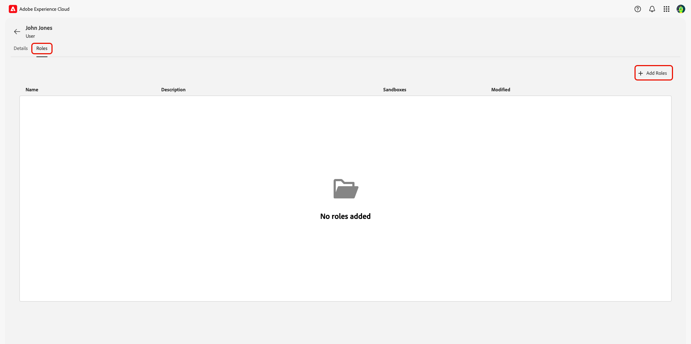

# Gérer l’accès des utilisateurs et utilisatrices via les autorisations {#manage-user-access}

{{limited-availability-release-note}}

Gérez les autorisations et l’accès des utilisateurs et utilisatrices à des composants individuels dans Adobe Real-Time CDP Collaboration via l’interface Experience Cloud [Autorisations](https://experienceleague.adobe.com/en/docs/experience-platform/access-control/abac/permissions-ui/browse){target="_blank"}. Les autorisations permettent aux administrateurs et administratrices système et produit de définir des [rôles](./manage-roles.md) afin de gérer l’accès des utilisateurs et utilisatrices à des fonctionnalités et ressources spécifiques.

## Configuration de l&#39;accès aux autorisations {#permissions-access}

Pour accéder aux autorisations, vous devez disposer d’un accès administrateur de produit et d’un accès utilisateur au produit Adobe Experience Platform. Un administrateur système est requis pour configurer les privilèges d’administrateur de produit, tandis que les privilèges d’utilisateur peuvent être configurés par un administrateur système ou de produit. Pour plus d’informations sur les rôles administratifs, consultez le guide [hiérarchie du contrôle d’accès](./overview.md#hierarchy).

>[!TIP]
>
>Tout au long de ce guide, un **administrateur** se réfère à **administrateurs système et administrateurs de produit**.

### Administrateurs système : configuration de l’accès administrateur de produit {#admin-access}

Accordez à un utilisateur ou une utilisatrice l’accès administrateur de produit pour lui donner des capacités administratives au sein du produit Experience Platform par le biais des étapes suivantes :

>[!IMPORTANT]
>
>En tant qu’administrateur système, vous disposez d’un accès prêt à l’emploi à des produits Experience Cloud spécifiques, tels que Adobe Admin Console. Toutefois, pour utiliser les autorisations, vous devez vous accorder un accès administrateur de produit et utilisateur au produit Experience Platform. Suivez le guide détaillé ci-dessous pour vous accorder l’accès en tant qu’administrateur système.

Connectez-vous à [Adobe Experience Cloud](https://experience.adobe.com/){target="_blank"} à l&#39;aide de vos identifiants. La vue d’accueil s’affiche avec une liste de vos produits disponibles dans la section **[!UICONTROL Accès rapide]**. Sélectionnez lʼ&#x200B;**[!UICONTROL Admin Console]**.

{zoomable="yes"}

Le tableau de bord de présentation de [Adobe Admin Console](https://adminconsole.adobe.com/) s&#39;affiche. Sélectionnez **[!UICONTROL Adobe Experience Platform]** dans la liste **[!UICONTROL Produits]** sous **[!UICONTROL Produits et services]**.

{zoomable="yes"}

Le tableau de bord Adobe Experience Platform s’affiche. Sélectionnez l’onglet **[!UICONTROL Administrateurs]** puis sélectionnez **[!UICONTROL Ajouter un administrateur]**.

Tableau de bord du produit {zoomable="yes"}

La boîte de dialogue **[!UICONTROL Ajouter des administrateurs de produit]** s’affiche. Saisissez l’adresse e-mail ou le nom d’utilisateur dans le champ de texte **[!UICONTROL E-mail ou nom d’utilisateur]**, puis sélectionnez le compte approprié dans la liste déroulante. Sélectionnez **[!UICONTROL Enregistrer]** pour terminer l’ajout de l’utilisateur en tant qu’administrateur de produit.

{zoomable="yes"}

L’utilisateur dispose désormais des privilèges d’administrateur de produit et peut effectuer des fonctions administratives, comme ajouter des utilisateurs ou d’autres administrateurs au produit dans Admin Console. Ils auront ensuite besoin d’un accès utilisateur au produit Experience Platform pour accéder et exécuter des fonctions dans le cadre des autorisations.

### Administrateurs : configuration de l’accès des utilisateurs à Experience Platform {#user-access}

Maintenant que vous avez accordé à l’utilisateur ou à l’utilisatrice un accès d’administrateur de produit, vous devez lui fournir un accès d’utilisateur au produit Experience Platform. Dans le cadre des configurations d’accès, vous affecterez des [profils de produit](https://helpx.adobe.com/fr/enterprise/using/manage-product-profiles.html) spécifiques à l’utilisateur.

>[!TIP]
>
>Si vous procédez comme indiqué dans la section précédente, vous vous trouvez déjà dans la catégorie Adobe Experience Platform et vous pouvez ignorer la première étape.

Accédez à [Admin Console](https://adminconsole.adobe.com/){target="_blank"} et sélectionnez **[!UICONTROL Adobe Experience Platform]** dans la liste **[!UICONTROL Produits]** sous **[!UICONTROL Produits et services]**.

{zoomable="yes"}

Sélectionnez l’onglet **[!UICONTROL Utilisateurs]** puis sélectionnez **[!UICONTROL Ajouter des utilisateurs]**.

Tableau de bord du produit {zoomable="yes"}

La boîte de dialogue **[!UICONTROL Ajouter des utilisateurs à ce produit]** s’affiche. Saisissez le nom ou l’adresse e-mail de l’utilisateur dans le champ de texte **[!UICONTROL Nom, groupe d’utilisateurs ou adresse e-mail]**, puis sélectionnez le compte approprié dans la liste déroulante. Sélectionnez ensuite l’option d’ajout **[!UICONTROL Produits]**.

{zoomable="yes"}

La boîte de dialogue **[!UICONTROL Sélectionner des profils de produit]** s’affiche. Sélectionnez **[!UICONTROL AEP-Default-All-Users]** et **[!UICONTROL Default Production All Access]** puis sélectionnez **[!UICONTROL Appliquer]**.

{zoomable="yes"}

Vérifiez que les informations sont correctes, puis sélectionnez **[!UICONTROL Enregistrer]**.

{zoomable="yes"}

L’utilisateur doit maintenant disposer d’un accès administrateur de produit et de produit à Experience Platform, lui permettant ainsi d’accéder aux autorisations. Ensuite, vous devez attribuer à l’utilisateur deux rôles fondamentaux pour lui donner accès à l’interface utilisateur d’Experience Platform.

### Administrateurs : configurer l’accès à l’interface utilisateur d’Experience Platform {#product-access}

Dans Real-Time CDP Collaboration, les administrateurs et les utilisateurs finaux utiliseront les données d’Experience Platform, telles que les audiences et les journaux d’audit. Ces données sont conservées dans des instances d’Experience Platform appelées sandbox. Pour que les utilisateurs puissent interagir avec ces données, vous devez affecter des [rôles par défaut](https://experienceleague.adobe.com/en/docs/experience-platform/access-control/home#default-roles){target="_blank"} à l’utilisateur.

Pour commencer, accédez à [Adobe Experience Cloud](https://experience.adobe.com/). Vous devriez maintenant voir **[!UICONTROL Experience Platform]** et **[!UICONTROL Autorisations]** dans **[!UICONTROL Accès rapide]**.

{zoomable="yes"}

>[!NOTE]
>
> L’accès aux produits peut prendre plusieurs minutes et vous recevrez un e-mail vous informant que vous y avez accès. Si vous ne voyez pas Experience Platform ou Autorisations dans Adobe Experience Cloud après avoir reçu l’e-mail, déconnectez-vous, puis reconnectez-vous à votre compte.

À ce stade, vous pouvez désormais accéder à **[!UICONTROL Autorisations]**. Si vous tentez d’accéder à **[!UICONTROL Experience Platform]**, un avertissement s’affiche indiquant qu’aucun sandbox n’est activé, comme illustré ci-dessous. Pour résoudre ce problème, vous devez affecter les rôles par défaut à votre utilisateur. Pour commencer, sélectionnez **[!UICONTROL Autorisations]**.

{zoomable="yes"}

Le tableau de bord **[!UICONTROL Autorisations]** s’affiche. Sélectionnez **Utilisateurs** dans le panneau de gauche, puis sélectionnez le nom de l’utilisateur.

{zoomable="yes"}

Sélectionnez l’onglet **[!UICONTROL Rôles]** puis sélectionnez **[!UICONTROL Ajouter des rôles]**.

{zoomable="yes"}

La boîte de dialogue **[!UICONTROL Ajouter des rôles]** s’affiche. Sélectionnez **[!UICONTROL Tous les accès de production par défaut]** et **[!UICONTROL Administrateurs Sandbox]**, puis sélectionnez **[!UICONTROL Enregistrer]**.

{zoomable="yes"}

Vous avez désormais accès à Experience Platform et aux autorisations. Lors de la dernière étape, vous allez accorder l’accès à Real-Time CDP Collaboration.

### Administrateurs : configuration de l’accès à Real-Time CDP Collaboration {#RTCDP-collaboration-access}

Pour accorder aux utilisateurs l’accès à Collaboration, vous allez utiliser un concept de contrôle d’accès appelé rôles. Les rôles définissent le niveau d’accès d’un administrateur ou d’un utilisateur aux [ressources](https://experienceleague.adobe.com/en/docs/experience-platform/access-control/home#permissions) de votre organisation.

Lors de la configuration de l&#39;accès individuel à Collaboration, vous attribuerez aux utilisateurs des rôles contenant des autorisations provenant de la ressource Collaborations. Vous pouvez utiliser le guide [gérer les rôles](./manage-roles.md) pour obtenir des informations sur :

- les [deux rôles standard](./manage-roles.md#standard-roles) et les niveaux d’accès qu’ils accordent à Collaboration
- création de [rôles personnalisés](./manage-roles.md#specific-access-roles) à l’aide de la ressource Collaboration
- la liste des autorisations incluses dans la ressource Collaborations

>[!NOTE]
>
>En outre, un utilisateur doit être affecté à un rôle contenant l’autorisation **[!UICONTROL Prod]** dans les ressources **[!UICONTROL Sandbox]**. Les deux rôles standard contiennent cette autorisation. Si vous choisissez d’attribuer à un utilisateur un rôle personnalisé au lieu d’un rôle standard, vous devez vous assurer que l’un des rôles qui lui sont attribués contient cette autorisation.

Une fois que vous avez choisi ou créé un rôle qui englobe le niveau d’accès dont votre utilisateur a besoin, vous devez affecter l’utilisateur à ce rôle.

#### Attribuer un rôle

Vous pouvez affecter plusieurs rôles à un seul utilisateur ou affecter plusieurs utilisateurs à un seul rôle. Le premier cas a été abordé précédemment lors de l’[affectation des rôles par défaut](#product-access) pour donner à un utilisateur l’accès à Experience Platform. Dans les étapes suivantes, vous affecterez directement des utilisateurs au rôle que vous avez sélectionné.

Dans **[!UICONTROL Autorisations]** sélectionnez **[!UICONTROL Rôles]** dans le panneau de gauche, puis sélectionnez votre rôle dans la liste.

{zoomable="yes"}

La page de détails du rôle s’affiche. Sélectionnez l’onglet **[!UICONTROL Utilisateurs]** puis sélectionnez **[!UICONTROL Ajouter des utilisateurs]**.

{zoomable="yes"}

La boîte de dialogue **[!UICONTROL Ajouter des utilisateurs]** s’affiche. Sélectionnez le ou les utilisateurs dans la liste, puis sélectionnez **[!UICONTROL Enregistrer]**.

{zoomable="yes"}

L’utilisateur doit maintenant voir **[!UICONTROL RTCDP Collaboration]** répertorié en tant que produit sous **[!UICONTROL Accès rapide]** dans Experience Cloud.

## Étapes suivantes

Maintenant que les utilisateurs ont accès à Real-Time CDP Collaboration, ils peuvent commencer à utiliser le produit. Pour en savoir plus sur le produit dans son ensemble, consultez le [guide de présentation](../home.md).
