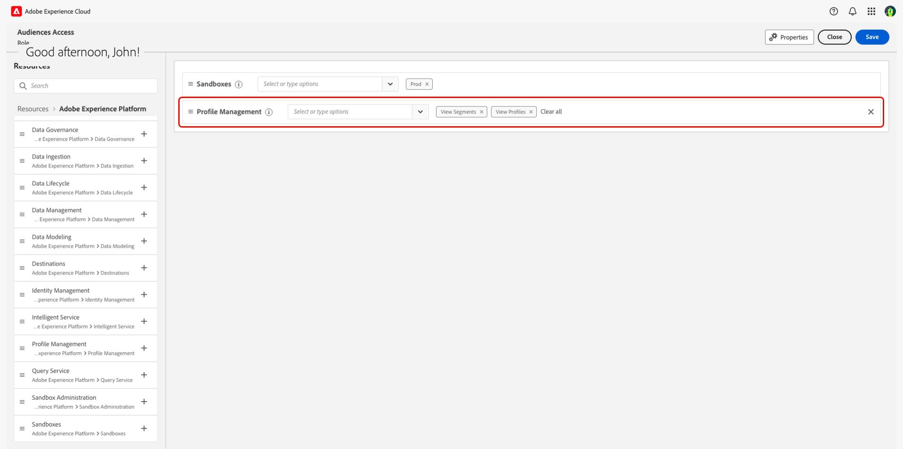

# Présentation du contrôle d’accès

{{limited-availability-release-note}}

>[!IMPORTANT]
>
> Si vous êtes un utilisateur final souhaitant accéder à Adobe Real-Time CDP Collaboration, contactez votre administrateur système ou produit pour vérifier l’existence d’un accès. Si vous ne savez pas qui est votre administrateur système, contactez votre représentant ou représentante Adobe.

Le contrôle d’accès d’Adobe Real-Time CDP Collaboration est fourni via Admin Console et les autorisations dans [Adobe Experience Cloud](https://experience.adobe.com/){target="_blank"}. Dans ce guide, vous apprendrez à donner accès à vous-même ou à d’autres membres de votre équipe, en fonction de votre cas d’utilisation.

## Hiérarchie du contrôle d’accès {#hierarchy}

Pour configurer le contrôle d’accès sur Collaboration, vous **devez** disposer de droits d’administrateur système ou produit. Un administrateur système n’a aucune restriction et est configuré pendant le processus d’intégration. En attendant, un administrateur produit peut fournir des fonctions administratives pour tous les produits auxquels il a été affecté. Un administrateur de produit doit disposer d’un accès de produit et d’administration de la part d’un administrateur système.

Ces guides décrivent la configuration de l’accès pour les administrateurs système, les administrateurs de produit et les utilisateurs finaux. Reportez-vous au tableau ci-dessous pour comprendre la différence clé entre les rôles.

| Rôle | Description |
| --- | --- |
| Administrateur système | Super utilisateur ou super utilisatrice de l’organisation. Ils sont en mesure d’effectuer toutes les tâches administratives dans Admin Console et disposent des autorisations pour déléguer des fonctions administratives à d’autres utilisateurs. |
| Administrateur de produit | Administre les produits qui leur sont affectés et toutes les fonctions administratives associées, telles que l’ajout d’utilisateurs à des organisations, l’ajout ou la suppression d’utilisateurs à des profils de produit, ainsi que l’ajout ou la suppression d’autres administrateurs de produit d’un produit. |
| Utilisateur final | Utilisateurs de votre entreprise qui utilisent les produits. |

{style="table-layout:auto"}

Pour plus d’informations sur les rôles administratifs, consultez le [Centre d’aide Adobe](https://helpx.adobe.com/fr/enterprise/using/admin-roles.html).

>[!TIP]
>
>L’utilisation de la mention **administrateurs** dans ces guides fait référence à **administrateurs système et produits**.

## Produits supplémentaires {#products}

Avant de pouvoir accorder l’accès à Collaboration, vous devez accéder à plusieurs produits, selon votre [cas d’utilisation](#use-cases). Les guides de contrôle d’accès peuvent fonctionner avec plusieurs interfaces utilisateur au fur et à mesure que vous avancez, chacune d’elles répondant à un objectif spécifique dans le processus de configuration des accès. Consultez le tableau ci-dessous pour mieux comprendre à quoi chaque produit servira.

| Produit | Utilise |
| --- | --- |
| [Admin Console](https://adminconsole.adobe.com/) | Les administrateurs l’utilisent pour attribuer aux utilisateurs un accès au produit et/ou aux administrateurs. |
| [Autorisations](https://experience.adobe.com/) | Les administrateurs l’utilisent pour affecter des rôles d’administrateurs ou d’utilisateurs finaux. |
| [Experience Platform](https://platform.adobe.com/) | Les administrateurs et les utilisateurs finaux doivent avoir accès au produit Experience Platform pour les affecter à des rôles. |

## Par où commencer {#use-cases}

Maintenant que vous avez une meilleure compréhension des rôles d’utilisateur et d’administration, ainsi que des différents produits Experience Cloud, vous pouvez commencer à donner accès à Collaboration. Deux facteurs principaux influencent les mesures que vous devrez prendre :

- si vous affectez un accès administrateur ou utilisateur final
- si les utilisateurs ont déjà accès au produit Experience Platform

Reportez-vous au graphique ci-dessous pour déterminer qui est nécessaire pour configurer les privilèges et où commencer en fonction de votre cas d’utilisation du contrôle d’accès. **Veillez à suivre le tutoriel jusqu’à la fin du guide, depuis votre point de départ.**

>[!TIP]
>
> Un super utilisateur fait référence au niveau d’accès le plus élevé que peut obtenir l’administrateur ou l’administratrice système. Un super utilisateur peut effectuer toutes les tâches administratives et exécuter toutes les fonctionnalités utilisateur. Un administrateur ou une administratrice système ne dispose pas de fonctionnalités de produit prêtes à l’emploi et doit se donner l’accès approprié, comme illustré dans le graphique ci-dessous.

| Cas d’utilisation | Rôle requis | Par où commencer |
| --- | --- | --- |
| Super utilisateur sans accès existant au produit Experience Platform. | Un administrateur système. | [Configuration de l’accès administrateur de produit](./manage-user-access.md#admin-access) |
| Super utilisateur pour un administrateur système Experience Platform existant **avec accès à**’interface utilisateur d’Experience Platform). | Un administrateur système. | [Configurer l’accès à Collaboration](./manage-user-access.md#RTCDP-collab-access) |
| Super utilisateur pour un administrateur système Experience Platform existant **sans accès** à l’interface utilisateur d’Experience Platform. | Un administrateur système. | [Configuration de l’accès administrateur de produit](./manage-user-access.md#admin-access) |
| Privilèges d’administrateur de produit et accès à Collaboration pour un nouvel administrateur de produit. | Un administrateur système. | [Configuration de l’accès administrateur de produit](./manage-user-access.md#admin-access) |
| Accès à Collaboration pour un administrateur de produit Experience Platform existant **avec** accès à l’interface utilisateur d’Experience Platform. | Un administrateur système ou produit. | [Configurer l’accès à Collaboration](./manage-user-access.md#RTCDP-collab-access) |
| Accès à Collaboration pour un administrateur de produit Experience Platform existant **sans accès** à l’interface utilisateur d’Experience Platform. | Un administrateur système ou produit. | [Configurer l’accès utilisateur](./manage-user-access.md#user-access) |
| Accès à Collaboration pour un nouvel utilisateur final. | Un administrateur système ou produit. | [Configurer l’accès utilisateur](./manage-user-access.md#user-access) |
| Accès à Collaboration pour un utilisateur existant disposant d’un accès à Experience Platform. | Un administrateur système ou produit. | [Configurer l’accès à Collaboration](./manage-user-access.md#RTCDP-collab-access) |

{style="table-layout:auto"}

## Autorisations supplémentaires

Une fois que vous avez obtenu l’accès à Collaboration, vous pouvez avoir besoin de certaines autorisations Experience Platform supplémentaires pour une fonctionnalité spécifique.

### Sourcing d’audience {#audience-sourcing}

Avant de pouvoir commencer à envoyer des audiences à vos collaborateurs, vous devez vous approvisionner en audiences dans Collaboration. Actuellement, la seule connexion de données en libre-service prise en charge pour l’importation d’audiences est Experience Platform. Pour commencer, la ou les personnes qui gèrent l’intégration de l’audience devront se voir attribuer un rôle contenant les autorisations de ressources **[!UICONTROL Gestion des profils]** suivantes :

| Autorisation | Description |
| ---- | ---- |
| [!UICONTROL Affichage des segments] | Permet à l’utilisateur d’afficher la liste des audiences disponibles dans un sandbox. |
| [!UICONTROL Affichage des profils] | Permet à l’utilisateur de voir les champs disponibles pour le mappage aux champs de collaboration. |

Vous trouverez ci-dessous un exemple de rôle avec les autorisations ajoutées ci-dessus. Pour plus d&#39;informations sur la création ou l&#39;affectation de rôles, consultez le guide [gérer les rôles](./manage-roles.md).

>[!NOTE]
>
>Les utilisateurs peuvent travailler avec des audiences dans Collaboration après avoir été sourcés sans l’une des autorisations ci-dessus.

## Étapes suivantes

Une fois que vous avez déterminé par où commencer, suivez le lien de votre cas d’utilisation pour commencer à configurer l’accès. Si vous souhaitez en savoir plus sur la configuration de l’accès à Collaboration en tant qu’administrateur au-delà de ces cas d’utilisation, reportez-vous au guide [gérer l’accès utilisateur](manage-user-access.md). Pour en savoir plus sur les rôles et leur rôle dans la configuration de l’accès aux différents composants de Collaboration, reportez-vous au guide [gérer les rôles](manage-roles.md).
