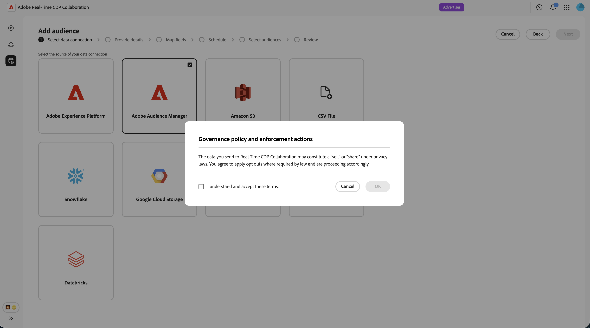

# Configuration de Adobe Audience Manager pour le sourcing d’audience

Découvrez comment connecter votre instance Adobe Audience Manager (AAM) à Adobe Real-Time CDP Collaboration afin de pouvoir approvisionner des segments propriétaires éligibles dans la plateforme. Après avoir créé la connexion, Collaboration récupère l’appartenance à une audience de Adobe Audience Manager selon un planning récurrent et met ces audiences à disposition pour l’analyse de chevauchement et l’activation dans vos projets de collaboration.

>[!NOTE]
>
> Les audiences provenant d’Audience Manager suivent les mêmes règles de gouvernance et de gestion des données que les audiences provenant de Adobe Experience Platform. Seuls les segments créés à partir de sources de données propriétaires sont éligibles. Les segments qui incluent des données tierces ou des sources Audience Marketplace ne sont pas pris en charge.

## Conditions préalables {#prerequisites}

Terminez tous les éléments de cette section avant de démarrer le workflow de configuration. Les prérequis incomplets sont la raison la plus courante de l’échec de la configuration ou de l’absence d’audiences après sourcing. Avant de suivre ce guide, vous devez avoir terminé [intégration et configuration du compte](./onboard-account.md).

### Accès et autorisations Adobe Audience Manager {#aam-access-and-permissions}

Avant de poursuivre, vérifiez que vous disposez des éléments suivants :

* Un contrat Adobe Audience Manager actif et une instance Audience Manager configurée.
* Accès à l’interface utilisateur d’Audience Manager avec l’autorisation d’afficher les segments que vous souhaitez approvisionner.
* Votre instance Audience Manager et votre compte Collaboration sont configurés sous la même organisation Adobe IMS. L’approvisionnement interorganisations n’est pas pris en charge.

### Exigences d’éligibilité des segments {#aam-segments-requirements}

Lorsque vous configurez la connexion, Collaboration filtre automatiquement la liste de segments en fonction des règles suivantes.

**Données propriétaires uniquement**

Seuls les segments basés sur vos propres données propriétaires sont disponibles pour l’approvisionnement. Les segments qui incluent des caractéristiques de fournisseurs de données tiers ou d’AAM Audience Marketplace sont exclus.

**Filtre Récence**

Seuls les segments qui ont été créés ou mis à jour **au cours des 13 derniers mois** sont disponibles pour la source. Les segments plus anciens sont exclus lors de la configuration de la connexion et à chaque actualisation ultérieure.

### Exigences de consentement {#consent-requirements}

Tous les segments AAM provenant de Collaboration doivent faire l’objet d’un filtrage après consentement. Si un marqueur d’opt-out est présent pour un profil au moment de l’exportation, ce profil est exclu avant d’atteindre Collaboration.

>[!IMPORTANT]
>
>Vous devez vous assurer que le consentement est correctement configuré et appliqué dans votre instance Audience Manager avant de vous connecter à Collaboration. Adobe ne réapplique pas les règles de consentement une fois que les données ont quitté Audience Manager.

## Configurer votre connexion Audience Manager {#configure-aam-connection}

Le workflow de configuration est un assistant à plusieurs étapes dans l’espace de travail **[!UICONTROL Configuration]**. Effectuez chaque étape dans l’ordre. Vous pouvez revenir à n’importe quelle étape à l’aide de l’icône en forme de crayon sur l’écran de révision final avant de créer la connexion.

### Ajouter une connexion aux données {#add-data-connection}

Dans l’onglet **[!UICONTROL Mes audiences]** de l’espace de travail **[!UICONTROL Configuration]**, sélectionnez l’icône d’ajout () puis sélectionnez **[!UICONTROL Audience]**.

S’il s’agit de votre première audience, vous pouvez également sélectionner l’option **[!UICONTROL Ajouter une audience]**.

Le workflow Ajouter une audience s’affiche. Sélectionnez **[!UICONTROL Ajouter une nouvelle connexion de données]** puis sélectionnez **[!UICONTROL Suivant]**.

{zoomable="yes"}

### Sélectionnez Adobe Audience Manager comme connexion aux données {#select-aam}

L’écran de sélection de la source de données répertorie tous les types de connexion disponibles. Sélectionnez **** comme connexion de données, puis sélectionnez **[!UICONTROL Suivant]**.

### Confirmer le consentement et l’utilisation des données {#confirm-consent-data-use}

Avant de poursuivre, vérifiez que vous avez appliqué les désinscriptions requises par la loi aux données d’audience que vous envoyez à Collaboration. Si vous ne savez pas si vos données répondent à cette exigence, consultez le guide [politique de gouvernance et mesures d’application](./onboard-audiences.md#governance-policy-and-enforcement-actions) avant de continuer. Cochez la case de confirmation, puis sélectionnez **[!UICONTROL OK]** pour continuer.

### Fournir les détails de la connexion {#provide-connection-details}

Saisissez ensuite un nom et une description facultative pour cette connexion de données. Une fois la connexion créée, le nom que vous fournissez apparaît dans l’onglet **[!UICONTROL Mes connexions de données]** et vous aide à identifier cette source à l’avenir.

* **[!UICONTROL Nom de la connexion de données]** (obligatoire)
* **[!UICONTROL Description de la connexion de données]** (facultatif)

Lorsque vous avez terminé, sélectionnez **[!UICONTROL Suivant]**.

### Vérifier le mappage d’identité {#review-identity-mapping}

L’écran **[!UICONTROL Mappage]** est en lecture seule. Collaboration mappe automatiquement les sorties d’identité prises en charge à partir de vos segments AAM vers les champs d’identité Collaboration. Pour plus d’informations, consultez le tableau suivant.

| Sortie d’identité AAM | Champ d’identité Collaboration | Notes |
| ------------------- | ---------------------------- | ----- |
| `Demdex ID` | `DEMDEX_ID` | Sortie d’identité prise en charge pour cette intégration. Collaboration ne traduit pas l’identifiant Demdex en ECID pendant l’approvisionnement. |
| `GAID` | `GAID` | Sortie d’identité prise en charge pour cette intégration. |
| `IDFA` | `IDFA` | Sortie d’identité prise en charge pour cette intégration. |

{style="table-layout:auto"}

Vous pouvez vérifier le mappage, mais vous ne pouvez pas le modifier à ce stade. Sélectionnez **[!UICONTROL Suivant]** pour continuer.

### Planifier l’actualisation des données {#schedule-data-refresh}

Dans la vue **[!UICONTROL Planifier]**, définissez la fréquence d’actualisation à laquelle Collaboration récupère les données d’appartenance à l’audience mises à jour de vos segments AAM, et définissez la période active pour l’approvisionnement.

Utilisez le menu déroulant **[!UICONTROL Fréquence]** pour sélectionner un intervalle d’actualisation compris entre un et six jours. Utilisez ensuite le calendrier pour définir les dates de début et de fin de l’approvisionnement de l’audience. Lorsque la date de fin est atteinte, le sourcing s’arrête et les audiences précédemment sourcées expirent.

>[!IMPORTANT]
>
>Les segments Audience Manager sont généralement actualisés toutes les 24 à 48 heures en fonction des règles de récence et de fréquence des caractéristiques. Définir un intervalle d’actualisation Collaboration inférieur à cette valeur peut consommer des crédits Collaboration sans mettre à jour les résultats. Pour surveiller votre utilisation du crédit, voir [Suivre votre activité de consommation du crédit](./my-activity.md).

Lorsque vous avez terminé, sélectionnez **[!UICONTROL Suivant]**.

### Sélectionner des audiences {#select-audiences}

Vous pouvez afficher une liste de segments éligibles qui utilisent des caractéristiques de source de données propriétaire et qui ont été créés ou mis à jour au cours des 13 derniers mois.

Sélectionnez les segments que vous souhaitez approvisionner dans Collaboration. Vous pouvez effectuer une recherche par nom ou faire défiler l’écran pour trouver des segments spécifiques. Sélectionnez **[!UICONTROL Suivant]** lorsque vous avez terminé.

>[!TIP]
>
>Si un segment que vous prévoyez de voir n’est pas répertorié, vérifiez qu’il a été mis à jour au cours des 13 derniers mois et qu’il utilise uniquement des caractéristiques de source de données propriétaires. Les segments comportant des caractéristiques tierces ou Audience Marketplace sont exclus.

### Vérifier et terminer la connexion {#review-and-complete}

Consultez le résumé complet de la configuration avant de créer la connexion. L’écran de résumé affiche les sections suivantes :

* **[!UICONTROL Détails]** : le nom et la description facultative de cette connexion de données.
* **[!UICONTROL Sélection de l’audience]** : segments AAM que vous avez sélectionnés.
* **[!UICONTROL Mappage]** : mappage des champs d’identité des champs sources AAM aux champs d’identité Collaboration.
* **[!UICONTROL Planification]** : fréquence d’actualisation et période active.

Sélectionnez l’icône en forme de crayon () en regard d’une section si vous devez apporter des modifications. Sélectionnez **[!UICONTROL Terminé]** pour confirmer toutes les sections.

Une boîte de dialogue de confirmation s’affiche, indiquant que la connexion de données a été créée et que l’approvisionnement de l’audience est en cours.

## Vérifier les audiences sources {#review-sourced-audiences}

Une fois l’assistant terminé, Collaboration commence à récupérer de manière asynchrone les données d’appartenance à l’audience de vos segments AAM sélectionnés. Accédez à **[!UICONTROL Configuration] > [!UICONTROL Mes audiences]** pour surveiller la progression.

### Surveiller la progression de l’approvisionnement des audiences {#monitor-progress}

Pendant que Collaboration récupère vos données de segment AAM, une bannière en haut de l’espace de travail **[!UICONTROL Mes audiences]** indique que le sourcing est en cours. Les audiences individuelles apparaissent dans la liste comme étant des approvisionnements terminés pour chaque segment.

### Afficher les détails de l’audience source {#view-sourced-audience-details}

Une fois l’approvisionnement terminé, vos segments AAM apparaissent dans l’onglet **[!UICONTROL Mes audiences]**. La colonne **** les identifie comme **[!UICONTROL Adobe Audience Manager]**.

Sélectionnez une ligne ou l’option **[!UICONTROL Afficher l’audience]** pour ouvrir la vue détaillée d’une audience spécifique.

La vue détaillée montre :

* **[!UICONTROL Identités]** : le nombre total d’identités et toutes les informations de répartition disponibles.
* **[!UICONTROL Catégories]** : toutes les balises que vous avez appliquées pour organiser ou filtrer l’audience.
* **[!UICONTROL Accès de connexion]** : indique si l’audience est privée, publique ou partagée avec des collaborateurs spécifiques.
* **[!UICONTROL Visibilité des métadonnées]** : quelles informations d’audience sont visibles pour les collaborateurs.

.

Utilisez cette vue pour confirmer les paramètres de configuration et de visibilité de l’audience avant d’utiliser l’audience dans des projets de collaboration. Pour mettre à jour les catégories, l’accès aux connexions ou la visibilité des métadonnées, consultez [Affichage et gestion des audiences individuelles](./onboard-audiences.md#view-individual-audiences).

## Limites connues

Tenez compte des contraintes suivantes lors de la configuration et de l’utilisation du connecteur source Audience Manager :

* **Données propriétaires uniquement :** les segments qui incluent des caractéristiques de fournisseurs de données tiers ou d’Adobe Audience Marketplace ne peuvent pas être sourcés. Seuls les segments créés entièrement à partir de vos propres sources de données propriétaires sont éligibles.
* **Fenêtre de récence du segment de 13 mois :** seuls les segments créés ou mis à jour au cours des 13 derniers mois peuvent être sélectionnés lors de la configuration et à chaque actualisation planifiée.
* **Aucune actualisation à la demande :** les données d’audience sont actualisées selon le planning que vous configurez. L’actualisation manuelle immédiate n’est pas prise en charge.
* **Une connexion AAM active par organisation :** une seule connexion de données AAM active est prise en charge par organisation IMS.
* **Contraintes de clé de correspondance :** une fois qu’une clé de correspondance est activée pour une connexion de données, elle ne peut pas être supprimée. Pour modifier les clés de correspondance actives, supprimez la connexion et créez-en une.

## Dépannage {#troubleshooting}

Lisez cette section pour résoudre les problèmes courants après avoir établi la connexion initiale.

**Les audiences n’apparaissent pas ou l’approvisionnement prend plus de temps que prévu**

* La durée de l’approvisionnement est mise à l’échelle en fonction du nombre de segments sélectionnés et de la taille de chaque population de segments.
* Si les audiences n’apparaissent pas dans les 24 heures, vérifiez que les segments que vous avez sélectionnés sont toujours actifs dans Audience Manager et que leur nombre de populations n’est pas nul.
* Vérifiez l’onglet **[!UICONTROL Mes connexions de données]** pour connaître les indicateurs d’erreur sur la connexion.
* Si le problème persiste, contactez le service clientèle d’Adobe en indiquant votre nom de connexion aux données et les noms des segments qui ne s’affichent pas.

**Un segment que je prévoyais de sélectionner n’était pas disponible lors de la configuration**

Vérifiez que le segment :

* A été créé ou mis à jour pour la dernière fois au cours des 13 derniers mois. Les segments plus anciens ne s’affichent pas.
* Utilise uniquement des caractéristiques propriétaires. Les segments comportant des caractéristiques tierces ou Audience Marketplace sont exclus.
* Appartient à l’organisation IMS configurée pour la connexion.

**La connexion de données affiche le statut En échec après le succès initial**

* Vérifiez que la relation de l’organisation IMS entre votre instance AAM et le compte Collaboration n’a pas changé.
* Vérifiez que les segments sélectionnés existent toujours dans AAM et n’ont pas été supprimés.
* Si le problème persiste, [supprimez la connexion](./manage-data-connection.md#delete-data-connection) puis créez-en une nouvelle, ou contactez l’assistance clientèle d’Adobe.

## Étapes suivantes {#next-steps}

Vous avez maintenant configuré Audience Manager en tant que source de données dans Collaboration. Une fois l’approvisionnement terminé, vos audiences sont disponibles dans l’espace de travail **[!UICONTROL Mes audiences]** et prêtes à être utilisées dans des projets de collaboration. Si vos audiences n’apparaissent pas une fois le processus de sourcing initial terminé, consultez la section [dépannage](#troubleshooting) de cette page.

Plusieurs possibilités sʼoffrent alors à vous :

* [Créer et gérer des projets de collaboration](../collaborate/manage-projects.md)
* [Activer des audiences dans un projet](../collaborate/activate.md)
* [Vérifier les chevauchements et mesurer les performances](../collaborate/measure.md)
* [Gérer les paramètres et la visibilité de l’audience](./onboard-audiences.md)
* [Gestion des connexions aux données](./manage-data-connection.md)

Pour d’autres méthodes d’approvisionnement d’audience, voir :

* [Configurer  [!DNL Amazon S3]  pour le sourcing d’audience](./configure-aws-s3-audience-sourcing.md)
* [Configurer  [!DNL Google Cloud Storage]  pour le sourcing d’audience](./configure-gcs-audience-sourcing.md)
* [Configurer  [!DNL Snowflake]  pour le sourcing d’audience](./configure-snowflake-audience-sourcing.md)
* [Audiences Source à partir d’Experience Platform](./onboard-audiences.md)
* [Chargement d’un fichier CSV pour l’audience](./upload-csv-audience-sourcing.md)
