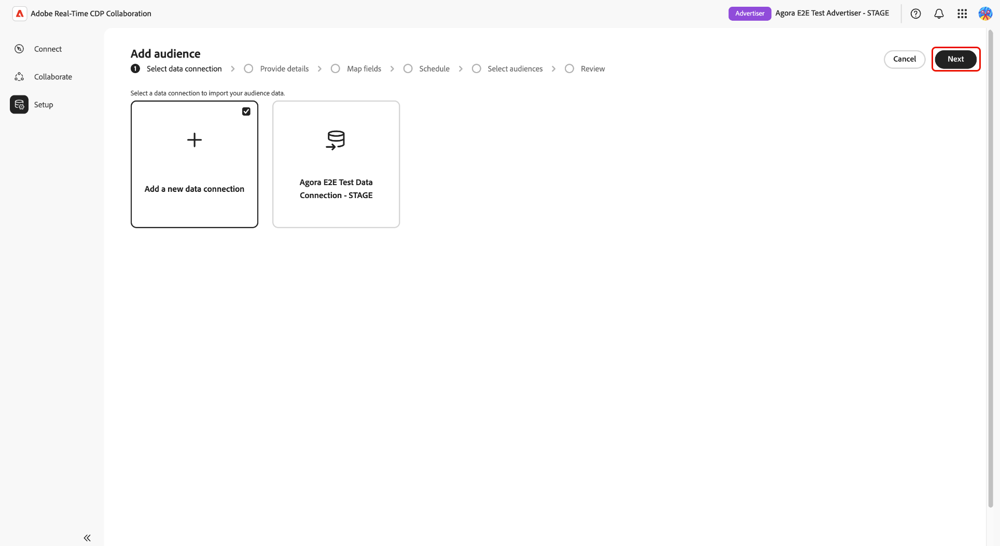
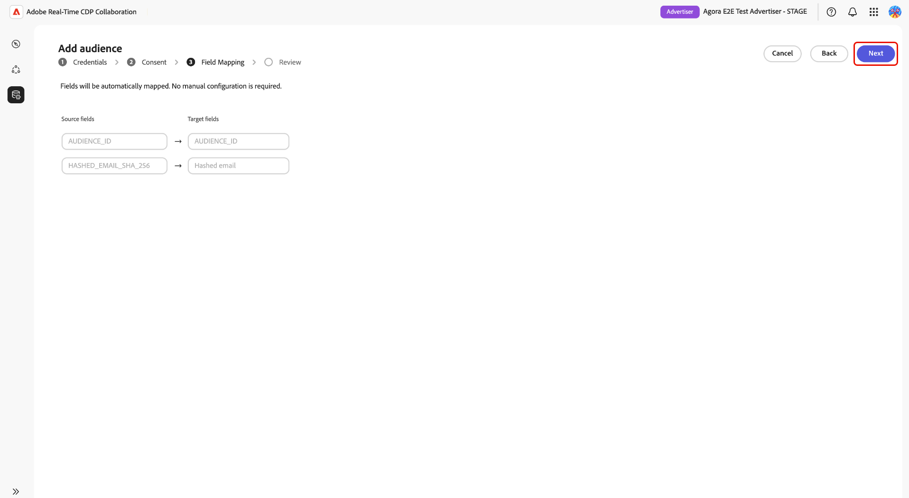
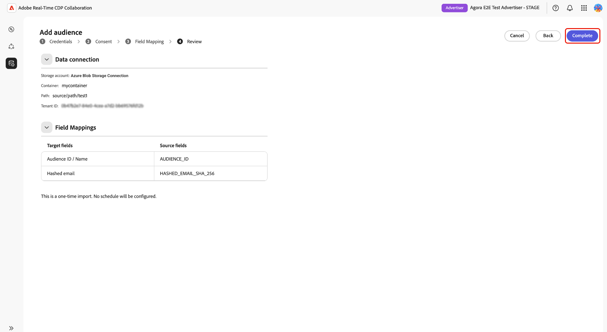

# Audiences Source à partir du stockage Azure

Connectez [!DNL Azure Blob Storage] ou [!DNL Azure Data Lake Storage] (ADLS) Gen2 à Adobe Real-Time CDP Collaboration pour obtenir des données d’audience propriétaires à des fins d’activation et d’analyse de chevauchement.

Utilisez ce guide pour créer une connexion de données [!DNL Azure] réutilisable et exécuter une importation unique à partir de l’emplacement de stockage configuré. Avant de commencer, vérifiez que vos fichiers d’audience répondent à la [Spécification d’approvisionnement de l’audience](../../assets/quick-start/RTCDP_Collaboration_Audience_Sourcing_Spec_v1_3.pdf). Vous accorderez à Adobe un accès en lecture à votre stockage Azure pendant le processus de configuration.

## Choisissez votre type de source [!DNL Azure] {#choose-source-type}

Collaboration prend en charge deux options d’ingestion de [!DNL Azure]. Utilisez le tableau ci-dessous pour sélectionner le chemin d’accès du guide qui correspond à l’emplacement de vos fichiers d’audience.

| | **[!DNL Azure Blob Storage]** | **[!DNL Azure Data Lake Storage]Gen2** |
|---|---|---|
| **À utiliser dans les cas suivants** | Les fichiers se trouvent dans un Blob standard **conteneur** sur un compte de stockage (aucun espace de noms hiérarchique requis). | Les fichiers se trouvent dans un **système de fichiers** sur un compte de stockage avec **espace de noms hiérarchique activé (ADLS Gen2)**. |
| Option **Source dans Collaboration** | **[!DNL Azure Blob Storage]** | **[!DNL Azure Data Lake Storage]Gen2** |
| **Champs obligatoires dans Collaboration** | Compte de stockage, **[!UICONTROL Conteneur]**, **[!UICONTROL Chemin]** | Compte de stockage, **[!UICONTROL Conteneur]** (système de fichiers ADLS Gen2), **[!UICONTROL Chemin]** |
| **Section Autorisations** | [[!DNL Azure Blob] autorisations](#set-up-azure-blob-storage-permissions) | [[!DNL Azure Data Lake Storage] Autorisations Gen2](#set-up-adls-gen2-permissions) |

Vous ne pouvez configurer **un seul type de source par connexion de données**. Pour utiliser à la fois [!DNL Blob] et ADLS, créez des connexions de données distinctes.

## Conditions préalables {#prerequisites}

Avant de suivre ce guide, terminez [&#x200B; intégration et configuration du compte &#x200B;](./onboard-account.md). Renseignez ensuite les prérequis de cette section avant de démarrer le workflow de configuration.

Certaines étapes nécessitent l’intervention d’un **[!DNL Azure]administrateur**. Si vous n’êtes pas l’administrateur [!DNL Azure] de votre organisation, identifiez la personne appropriée avant de commencer.

### Accès et autorisations [!DNL Azure] {#azure-access-and-permissions}

Avant de configurer la connexion dans Collaboration, vous ou votre administrateur [!DNL Azure] devez octroyer à Adobe l’accès en lecture au conteneur de stockage ou au système de fichiers ADLS Gen2 contenant vos fichiers d’audience. Une fois la configuration des autorisations terminée, le workflow de configuration Collaboration valide l’accès lors de l’étape **[!UICONTROL Consentement]**.

### Préparation des données d’audience {#prepare-audience-data}

Vos fichiers d’audience doivent être conformes à la **[Spécification d’approvisionnement de l’audience (v1.2)](../../assets/quick-start/RTCDP_Collaboration_Audience_Sourcing_Spec_v1_3.pdf)** avant que l’approvisionnement ne commence.

Les principales exigences sont les suivantes :

* **Format de fichier :** CSV, en utilisant des virgules comme délimiteurs de champ et des barres verticales (`|`) comme séparateurs pour plusieurs valeurs dans un seul champ.
* **Champs obligatoires :** chaque enregistrement doit inclure une colonne `AUDIENCE_ID` et au moins une colonne clé de correspondance prise en charge.
* **Clés de correspondance prises en charge :** `HASHED_EMAIL_SHA_256`, `HASHED_PHONE_SHA_256`, `HASHED_IPV4_SHA_256`, `CRM_ID`, `LOYALTY_ID`, `ADFIXUS_ID`.
* **Exigences de hachage :** toutes les valeurs de clé correspondantes doivent être tronquées, mises en minuscules et hachées SHA256 avant le chargement. Collaboration ne hache ni ne normalise les données avant l’ingestion.
* **Cohérence des colonnes :** tous les fichiers situés sous votre chemin d’accès configuré doivent utiliser des structures de colonnes identiques.

Toutes les clés de correspondance présentes dans vos fichiers d’audience doivent également être activées pour votre compte Collaboration. Voir [Configurer des clés de correspondance](https://experienceleague.adobe.com/fr/docs/real-time-cdp-collaboration/using/setup/onboard-account#set-up-match-keys) pour obtenir des conseils.

>[!IMPORTANT]
>
> Les clés de correspondance activées pour une connexion de données ne peuvent pas être supprimées une fois la connexion créée. Pour modifier le jeu actif de clés de correspondance, vous devez supprimer la connexion et en créer une nouvelle. Confirmez la configuration complète de votre clé de correspondance avant de démarrer le workflow de configuration.

### Valeurs requises avant de commencer {#values-required}

Préparez les valeurs suivantes avant de démarrer le workflow de configuration.

| Valeur | Description | Exemple de stockage Blob Azure | Exemple ADLS Gen2 |
| ------------------- | ------------------------ | -------------------------------------- | -------------------------------------- |
| **Compte de stockage** | Nom du compte de stockage [!DNL Azure] qui héberge vos fichiers d’audience. | `customerdatastore` | `datalake-prod` |
| **Conteneur** | Par [!DNL Azure Blob Storage], le conteneur de stockage qui contient vos fichiers d’audience. Pour [!DNL Azure Data Lake Storage] Gen2, saisissez le nom du système de fichiers ADLS Gen2 dans le champ **[!UICONTROL Conteneur]**. | `audience-ingest` | `audiences` |
| **Chemin** | Chemin d’accès au dossier dans le conteneur ou le système de fichiers contenant les fichiers d’audience à ingérer. Collaboration n’ingère que les fichiers directement sous le chemin configuré et n’ingère pas les fichiers des sous-dossiers imbriqués. | `sourcing/audiences/path1/` | `sourcing/inbound/` |
| **ID de client** | Identifiant client Microsoft Entra associé à votre compte de stockage [!DNL Azure]. | `00000000-0000-0000-0000-000000000000` | `00000000-0000-0000-0000-000000000000` |

## Configurer les autorisations [!DNL Azure] {#set-up-azure-permissions}

Suivez les étapes de cette section pour préparer votre environnement de [!DNL Azure]. Adobe nécessite un accès en lecture à votre conteneur de stockage avant que le workflow de configuration de Collaboration puisse établir une connexion. Ce travail est effectué sur le portail [!DNL Azure] et peut être complété par votre administrateur [!DNL Azure].

Une fois cette section terminée, passez à [Configurer votre [!DNL Azure] connexion](#configure-your-azure-connection).

### Obtention de l’identifiant principal du service [!DNL Azure] Adobe {#obtain-principal-identifier}

Avant d’effectuer les étapes d’affectation de rôle ci-dessous, contactez l’équipe de votre compte Adobe pour obtenir l’identifiant principal de service [!DNL Azure] pour votre région (Amérique du Nord, EMEA ou Australie et Nouvelle-Zélande). Vous utiliserez cet identifiant pour accorder à Adobe un accès en lecture à votre stockage .

### Configurer les autorisations [!DNL Azure Blob Storage] {#set-up-azure-blob-storage-permissions}

>[!IMPORTANT]
>
> Vous avez besoin d’autorisations pour affecter des rôles sur le compte ou le conteneur de stockage (par exemple, **Propriétaire** ou **Administrateur d’accès utilisateur**, ou équivalent).

1. Dans le [[!DNL Azure] portail](https://portal.azure.com/), ouvrez le compte de stockage, puis accédez à **[!UICONTROL Conteneurs]** et sélectionnez le conteneur qui contient vos fichiers d’audience.
2. Sélectionnez **[!DNL Access control (IAM)]**, puis sélectionnez **[!DNL Add role assignment]**.
3. Attribuez le rôle **[!DNL Storage Blob Data Reader]** au principal de sécurité Adobe au niveau de la portée du conteneur.
4. Sélectionnez **Enregistrer**.

### Configurer les autorisations ADLS Gen2 {#set-up-adls-gen2-permissions}

Pour les connexions ADLS Gen2, le champ **[!UICONTROL Conteneur]** dans Collaboration correspond au système de fichiers ADLS Gen2 dans [!DNL Azure]. Utilisez le système de fichiers qui contient vos fichiers d’audience.

Avant d’attribuer des autorisations, vérifiez que le compte de stockage a **espace de noms hiérarchique activé** et que les règles de pare-feu ou de point d’entrée privé autorisent l’accès à Adobe.

1. Dans le [[!DNL Azure] portail](https://portal.azure.com/), ouvrez le compte de stockage contenant votre système de fichiers ADLS Gen2.
2. Ouvrez le système de fichiers qui contient les fichiers de votre audience.
3. Sélectionnez **[!UICONTROL Contrôle d’accès (IAM)]** puis sélectionnez **[!UICONTROL Ajouter une affectation de rôle]**.
4. Attribuez le rôle **[!DNL Storage Blob Data Reader]** au principal de sécurité Adobe au niveau du système de fichiers ou de la portée du répertoire.
5. Sélectionnez **[!UICONTROL Enregistrer]**.

Une fois que vous avez terminé la configuration des autorisations pour votre type de source, passez à [&#x200B; Configurer votre  [!DNL Azure]  connexion &#x200B;](#configure-your-azure-connection).

## Configurer votre connexion [!DNL Azure] {#configure-your-azure-connection}

Utilisez le workflow de configuration Collaboration pour valider les détails de stockage de vos [!DNL Azure], confirmer l’accès à Adobe, vérifier les champs d’identité mappés automatiquement et créer la connexion aux données.

### Ajouter une nouvelle connexion de données {#add-new-data-connection}

Accédez à **[!UICONTROL Configuration]** > **[!UICONTROL Mes audiences]**, puis sélectionnez l’icône d’ajout () et choisissez **[!UICONTROL Audience]**.

{zoomable="yes"}

Le workflow **[!UICONTROL Ajouter une audience]** s’affiche. Sélectionnez **[!UICONTROL Ajouter une nouvelle connexion de données]** puis sélectionnez **[!UICONTROL Suivant]**.

{zoomable="yes"}

### Sélectionner la source de données [!DNL Azure] {#select-azure-data-source}

Sélectionnez **[!UICONTROL Azure Blob Storage]** ou **[!UICONTROL Azure Data Lake Storage Gen2]**, puis sélectionnez **[!UICONTROL Suivant]**.

![Le workflow Ajouter une audience qui affiche les [!DNL Azure Blob Storage] sélectionnées comme type de connexion de données et les étapes d’intégration Informations d’identification, consentement, mappage des champs et révision.](../../assets/setup/azure-sourcing/azure-source-selection-step.png){zoomable="yes"}

Continuez à suivre les étapes restantes pour valider votre connexion Azure, confirmer l’accès Adobe, vérifier les mappages de champs et créer la connexion aux données.

### Saisir les informations d’identification de connexion {#enter-connection-credentials}

À l’étape **[!UICONTROL Informations d’identification]**, fournissez les informations requises pour accéder à l’emplacement de stockage de votre [!DNL Azure].

| Champ | Description |
|---|---|
| **[!UICONTROL Compte de stockage]** | Le compte de stockage [!DNL Azure] qui contient vos fichiers d’audience. |
| **[!UICONTROL Conteneur]** | Conteneur de stockage ou système de fichiers ADLS Gen2 contenant vos fichiers d’audience. |
| **[!UICONTROL Chemin]** | Le chemin d’accès au dossier dans le conteneur où vos fichiers d’audience sont stockés. |
| **[!UICONTROL ID de client]** | Identifiant de client [!DNL Azure] associé à votre compte de stockage . |

Après avoir saisi les valeurs requises, sélectionnez **[!UICONTROL Se connecter à Azure]**.

Un message de confirmation indique que la connexion a bien été établie. Sélectionnez **[!UICONTROL Suivant]** pour continuer.

![l’étape Informations d’identification affichant les champs de compte de stockage, de conteneur, de chemin d’accès et d’ID client terminés avec un message de confirmation Connecté à [!DNL Azure] . &#x200B;](../../assets/setup/azure-sourcing/azure-credentials-step.png){zoomable="yes"}

### Octroi d’un accès Adobe à votre stockage [!DNL Azure] {#grant-adobe-access}

À l’étape **[!UICONTROL Consentement]**, Collaboration valide les autorisations [!DNL Azure] que vous avez configurées précédemment.

Sélectionnez l’icône de lancement en regard de **[!UICONTROL URL de consentement]** pour ouvrir le workflow d’autorisation dans [!DNL Azure]. Connectez-vous à l’aide d’un compte autorisé à accorder le consentement pour l’emplacement de stockage , puis remplissez les invites d’autorisation Azure qui accordent l’accès d’Adobe à l’emplacement de stockage configuré. Une fois l’autorisation terminée, revenez à Collaboration et sélectionnez **[!UICONTROL Confirmer le consentement]** pour valider l’accès à Adobe.

>[!NOTE]
>
>La propagation des affectations de rôles [!DNL Azure] peut prendre plusieurs minutes. Si la validation du consentement ne réussit pas immédiatement, patientez quelques minutes, vérifiez que le principal de service Adobe dispose de l’affectation de rôle requise, puis réessayez.

Lorsque la validation du consentement réussit, un message de confirmation **[!UICONTROL Consentement accordé]** s’affiche. Sélectionnez **[!UICONTROL Suivant]** pour continuer.

![l’étape Consentement affichant une URL de consentement, l’identifiant de l’application \[!DNL Azure\] et un message de confirmation Consentement accordé.](../../assets/setup/azure-sourcing/azure-consent-granted-step.png){zoomable="yes"}

### Vérifier les mappages de champs {#review-field-mappings}

À l’étape **[!UICONTROL Mappage de champs]**, Collaboration mappe automatiquement les champs d’identité pris en charge à partir de vos fichiers sources.

Aucune configuration manuelle n’est requise.

>[!IMPORTANT]
>
> Collaboration mappe automatiquement les champs d’identité en fonction de la spécification d’approvisionnement d’audience. Si les mappages affichés sont incorrects, mettez à jour vos fichiers sources avant de terminer le workflow d’intégration.

Passez en revue les mappages affichés et vérifiez que les champs sources correspondent aux colonnes d’identité de vos fichiers d’audience. Sélectionnez **[!UICONTROL Suivant]** pour continuer.

{zoomable="yes"}

### Vérifier et terminer la connexion {#review-and-complete}

À l’étape **[!UICONTROL Révision]**, vérifiez le compte de stockage, le conteneur, le chemin d’accès source, l’ID client et les mappages de champs.

La page de révision indique également que le workflow de [!DNL Azure] actuel effectue une seule exécution de sourcing et ne configure pas de planification récurrente.

Lorsque la configuration est correcte, sélectionnez **[!UICONTROL Terminé]**.

{zoomable="yes"}

## Confirmer la connexion et surveiller les audiences sources {#confirm-connection-and-monitor-audiences}

Après avoir sélectionné **[!UICONTROL Terminé]**, Collaboration crée la connexion de données et vous permet d’accéder à **[!UICONTROL Configuration]** > **[!UICONTROL Mes connexions de données]**.

### Vérifiez que la connexion a été créée. {#confirm-connection-created}

La carte de connexion dans **[!UICONTROL Mes connexions de données]** confirme que la connexion a bien été créée. La carte affiche le type de source (**[!UICONTROL Azure Blob Storage]** ou **[!UICONTROL Azure Data Lake Storage] Gen2**), la date de création, les clés de correspondance, le nombre de profils des audiences et le statut de connexion actuel.

![Vue Mes connexions de données affichant une carte de connexion [!DNL Azure Blob Storage] nouvellement créée avec les détails de connexion, les clés de correspondance, le nombre de profils des audiences et les informations de statut.](../../assets/setup/azure-sourcing/azure-data-connection-card.png){zoomable="yes"}

### Afficher les audiences sources {#view-sourced-audiences}

Une fois la connexion créée, Collaboration commence automatiquement à sourcer les audiences à partir de l’emplacement [!DNL Azure] configuré. Accédez à **[!UICONTROL Configuration]** > **[!UICONTROL Mes audiences]** pour surveiller la progression de l’approvisionnement et consulter les audiences approvisionnées.

Les audiences sources apparaissent dans le tableau **[!UICONTROL Mes audiences]**. Utilisez le statut de l’audience, le nombre d’identités, la source, la connexion aux données et la date de dernière mise à jour pour confirmer que les audiences attendues proviennent de votre connexion [!DNL Azure].

>[!TIP]
>
>Le temps d’approvisionnement varie en fonction du volume de données. Si les audiences ne s’affichent pas après 24 heures, voir [Dépannage](#troubleshooting).

## Limites connues {#known-limitations}

Vérifiez les limites suivantes avant de créer ou de gérer une connexion de données Azure.

* **Contraintes de clé de correspondance :** les clés de correspondance ne peuvent pas être supprimées d’une connexion existante. Pour modifier les clés de correspondance actives, supprimez la connexion et créez-en une.
* **Une connexion active par type de source [!DNL Azure] :** vous pouvez avoir une connexion Blob active et une connexion ADLS Gen2 active par compte. Pour modifier l’emplacement de stockage, supprimez la connexion existante et créez-en une nouvelle.
* **Prise en charge des sous-dossiers :** Collaboration n’ingère que les fichiers directement sous le chemin configuré. Il n’ingère pas les fichiers des sous-dossiers imbriqués.
* **Types de source distincts :** Blob et ADLS Gen2 sont des connexions distinctes ; ne mélangez pas la configuration dans une seule exécution d’assistant.

## Dépannage {#troubleshooting}

### Les audiences n’apparaissent pas ou le sourcing est lent {#audiences-not-appearing}

Si les audiences sources n’apparaissent pas après la création de la connexion, effectuez les actions suivantes.

* Vérifiez que les fichiers d’audience existent directement sous le chemin d’accès configuré et sont conformes aux spécifications d’approvisionnement de l’audience.
* Vérifiez **[!UICONTROL Mes connexions de données]** pour détecter les erreurs.
* Contactez l’assistance Adobe avec le nom de la connexion, le compte de stockage et les détails du conteneur si les problèmes persistent après 24 heures.

### Audiences source mais affichent zéro identité ou une identité inattendue {#zero-identities}

Si les audiences apparaissent après le sourcing mais que le nombre d’identités est nul ou inférieur à ce qui était attendu, effectuez les actions suivantes.

* Vérifiez que toutes les valeurs de clé correspondantes dans vos fichiers d’audience ont été tronquées, mises en minuscules et SHA256-hachées avant le chargement. Collaboration ne hache ni ne normalise les données lors de l’ingestion.
* Vérifiez que les clés de correspondance présentes dans vos fichiers sont activées pour votre compte Collaboration. Voir [Configurer des clés de correspondance](https://experienceleague.adobe.com/fr/docs/real-time-cdp-collaboration/using/setup/onboard-account#set-up-match-keys).

### Échec de la connexion après le succès initial {#connection-failed}

Utilisez ces vérifications lorsqu’une connexion a été créée avec succès, mais passe ensuite à l’état d’échec.

* Vérifiez que l’affectation de rôle RBAC [!DNL Azure] pour le principal d’Adobe n’a pas été supprimée ou réduite.
* Vérifiez que les fichiers existent toujours au niveau du chemin d’accès et correspondent à la spécification.

### Erreurs d’import ou de format {#format-errors}

Utilisez ces contrôles lorsque le sourcing échoue en raison de problèmes de structure de fichiers, de hachage ou de format de colonne.

* Assurez-vous que tous les fichiers conservent la même structure de colonnes et les mêmes règles de hachage que l’ingestion initiale.

## Étapes suivantes {#next-steps}

Une fois l’approvisionnement terminé, les audiences sont disponibles dans **[!UICONTROL Mes audiences]** pour l’activation, l’analyse de chevauchement et les workflows de mesure. Pour activer les audiences sources avec des collaborateurs, voir [Activer les audiences](../collaborate/activate.md).

D’autres méthodes de source disponibles incluent Experience Platform, [!DNL Amazon S3], [!DNL Google Cloud Storage], [!DNL Snowflake] et le chargement de fichiers CSV. Pour d’autres méthodes d’approvisionnement d’audience, voir :

* [Configuration de Google Cloud Storage pour le sourcing d’audience](./configure-gcs-audience-sourcing.md)
* [Configuration de Snowflake pour le sourcing d’audience](./configure-snowflake-audience-sourcing.md)
* [Configuration d’AWS S3 pour le sourcing d’audience](./configure-aws-s3-audience-sourcing.md)
* [Audiences Source à partir d’Experience Platform](./onboard-audiences.md)
* [Chargement d’un fichier CSV pour l’audience](./upload-csv-audience-sourcing.md)
