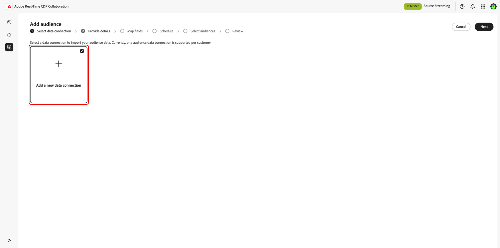
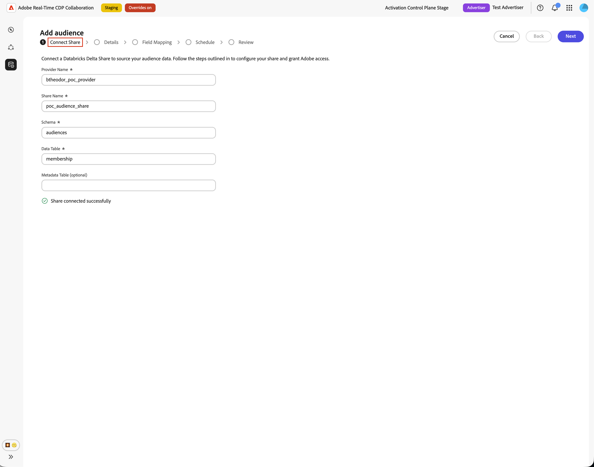
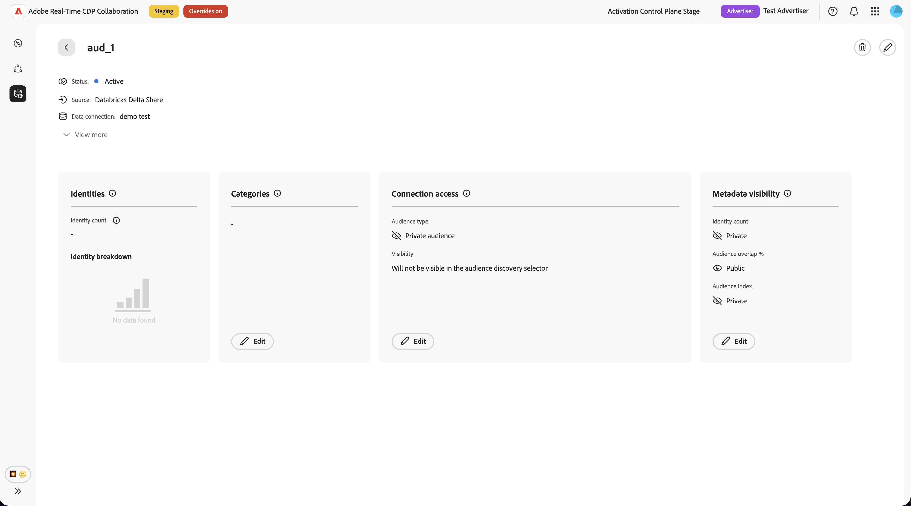

# Configuration des [!DNL Databricks Delta Share] pour l’approvisionnement des audiences

Utilisez ce guide pour connecter [!DNL Databricks Delta Share] à Adobe Real-Time CDP Collaboration et créer des audiences propriétaires via l’interface utilisateur.

Lorsque vous vous connectez [!DNL Databricks Delta Share], Collaboration lit les données d’audience directement à partir de votre partage de catalogue Unity. Une fois l’approvisionnement terminé, vous pouvez utiliser les audiences pour l’activation et l’analyse de chevauchement dans les projets de collaboration.

Ce guide explique comment préparer les conditions préalables, connecter votre [!DNL Delta Share], spécifier des tables source, mapper des champs d’identité et vérifier que l’approvisionnement de l’audience démarre correctement.

Les audiences provenant de [!DNL Databricks] suivent les mêmes règles de gouvernance et de gestion des données que les audiences provenant de Adobe Experience Platform et d’autres sources cloud prises en charge.

Les autres méthodes de source disponibles sont les suivantes : , [Amazon S3](./configure-aws-s3-audience-sourcing.md), [Google Cloud Storage](./configure-gcs-audience-sourcing.md), [Snowflake](./configure-snowflake-audience-sourcing.md), [Azure storage](./configure-azure-storage-audience-sourcing.md) et [téléchargement de fichier CSV](./upload-csv-audience-sourcing.md). Pour en savoir plus sur toutes les sources disponibles dans Collaboration, voir [Présentation des sources](./source-overview.md).

## Conditions préalables {#prerequisites}

Remplissez les conditions préalables décrites dans cette section avant de démarrer le workflow de configuration. Les conditions préalables manquantes sont une raison courante pour laquelle la configuration échoue ou les audiences n’apparaissent pas après le sourcing. Avant de suivre ce guide, terminez [ intégration et configuration du compte ](./onboard-account.md).

Certaines tâches de ce guide nécessitent l’aide d’un administrateur [!DNL Databricks]. Si vous n’administrez pas [!DNL Databricks] pour votre organisation, contactez l’administrateur ou administratrice approprié(e) avant de commencer.

### accès [!DNL Databricks Delta Share] {#databricks-delta-share-access}

Avant de poursuivre, vérifiez les points suivants auprès de votre administrateur [!DNL Databricks] :

* Votre organisation a publié un [!DNL Delta Share] sur le compte [!DNL Databricks] d’Adobe à l’aide du partage natif de briques de données à briques de données (catalogue Unity). Collaboration ne prend pas en charge les entrées d’informations d’identification de jeton porteur ou OIDC dans l’interface utilisateur pour ce workflow.
* Vous connaissez le nom du fournisseur tel qu’il est enregistré dans le métastore du catalogue Unity d’Adobe, le nom du partage et le schéma qui contient vos tables d’audience.
* [!DNL Databricks Delta Share]’approvisionnement des audiences est disponible pour votre compte Collaboration et votre région. Si l’approvisionnement en briques de données n’est pas encore disponible dans votre région, contactez votre représentant de compte Adobe pour confirmer une chronologie.

Pour obtenir des instructions détaillées sur la publication d’un partage dans Adobe, reportez-vous à la section [Publier votre partage Delta dans Adobe](#publish-delta-share) de ce guide.

### Préparation des données d’audience {#prepare-audience-data}

Structurez vos tableaux d’audience afin que Collaboration puisse découvrir des audiences et mapper correctement les identités.

* **Table d’appartenance (obligatoire) :** table de votre schéma partagé qui contient une ligne par paire profil-audience. Cette table doit inclure une colonne mappable à `AUDIENCE_ID` et au moins une colonne clé de correspondance prise en charge. Collaboration utilise cette table pour l’aperçu des données sources et le mappage des champs.
* **Table de métadonnées (facultatif) :** si vous conservez un catalogue distinct d’audiences (une ligne par audience avec un identifiant d’audience, un nom, des nombres ou des métadonnées similaires), vous pouvez fournir cette table afin que Collaboration lise les définitions d’audience à partir de celle-ci au lieu de déduire des identifiants d’audience distincts à partir de la table d’appartenance seule.
* **Clés de correspondance prises en charge :** `HASHED_EMAIL_SHA_256`, `HASHED_PHONE_SHA_256`, `HASHED_IPV4_SHA_256`, `CRM_ID`, `LOYALTY_ID`, `ADFIXUS_ID` et autres clés de correspondance activées pour votre compte Collaboration.
* **Exigences de hachage :** toutes les valeurs de clé correspondantes doivent être tronquées, mises en minuscules et hachées SHA256 avant d’être stockées dans [!DNL Databricks]. Collaboration ne hache ni ne normalise les données avant l’ingestion.
* **Cohérence des colonnes :** la table d’appartenance doit exposer des noms de colonnes stables que Collaboration peut mapper à vos clés de correspondance activées.

Toutes les clés de correspondance présentes dans votre table d’abonnement doivent également être activées pour votre compte Collaboration. Pour ajouter ou activer des clés de correspondance, voir [Configurer des clés de correspondance](./onboard-account.md#set-up-match-keys).

### Valeurs requises avant de commencer {#required-values}

Préparez les valeurs suivantes avant de démarrer l’assistant de configuration.

| Valeur | Description |
| ----- | ----------- |
| Nom du fournisseur | Identifiant de fournisseur qu’Adobe utilise dans le catalogue Unity pour accéder à votre [!DNL Delta Share]. Votre administrateur [!DNL Databricks] ou votre contact d’intégration Adobe peut fournir cette valeur. Cette valeur n’est pas identique à l’URL de votre espace de travail [!DNL Databricks]. |
| Partager le nom | Nom du [!DNL Delta Share] publié sur Adobe. |
| Schéma | Le schéma dans le partage qui contient vos tableaux d’audience. |
| Table des appartenances | Nom de la table dans le schéma qui contient les lignes d’appartenance à l’audience (une ligne par profil dans une audience). |
| Table de métadonnées (facultatif) | Nom de la table dans le schéma qui répertorie les audiences (une ligne par audience), si vous utilisez un catalogue d’audiences piloté par les métadonnées. |

{style="table-layout:auto"}

## Configurer votre connexion [!DNL Databricks] {#configure-databricks-connection}

Le workflow de configuration est un assistant à plusieurs étapes dans l’espace de travail **[!UICONTROL Configuration]**. Effectuez chaque étape dans l’ordre.

### Ajouter une nouvelle connexion de données {#add-data-connection}

Dans l’onglet **[!UICONTROL Mes audiences]** de l’espace de travail **[!UICONTROL Configuration]**, sélectionnez l’icône d’ajout () puis sélectionnez **[!UICONTROL Audience]**.

S’il s’agit de votre première audience, vous pouvez également sélectionner l’option **[!UICONTROL Ajouter]**.

Le workflow Ajouter une audience s’affiche. Sélectionnez **[!UICONTROL Ajouter une nouvelle connexion de données]** puis sélectionnez **[!UICONTROL Suivant]**.

{zoomable="yes"}

### Sélectionner [!DNL Databricks Delta Share] comme source de données {#select-databricks-delta-share}

L’écran de sélection de la source de données répertorie tous les types de connexion disponibles. Sélectionnez **[!UICONTROL Partage Delta des briques de données]** puis sélectionnez **[!UICONTROL Suivant]**.

### Connecter votre [!DNL Delta Share] {#connect-delta-share}

>[!CONTEXTUALHELP]
>id="rtcdp_collaboration_audience_sharing_databricks"
>title="Experience League"
>abstract="Pour obtenir des instructions sur la configuration de votre partage pour le sourcing d’audience, consultez le guide de sourcing [!DNL Databricks Delta Share] ."

Fournissez les détails requis pour permettre à Collaboration d’accéder à votre [!DNL Delta Share]. Saisissez les détails du fournisseur, du partage, du schéma et de la table à partir de votre [!DNL Databricks Delta Share]. La table d’appartenance requise doit être disponible dans le schéma partagé. Si vous utilisez une table de métadonnées, elle doit également être disponible dans le même schéma partagé.
Après avoir saisi les informations requises, sélectionnez **[!UICONTROL Connexion]**.

Collaboration valide le partage et le monte dans l’espace de travail Adobe. Cette étape peut prendre jusqu’à une minute. Un indicateur de progression s’affiche lorsque la connexion est établie.

| Champ | Description |
| --- | --- |
| **[!UICONTROL Nom du fournisseur]** | Le nom du fournisseur de catalogues Unitaires utilisé par Adobe pour consommer votre partage. Voir [Valeurs requises avant de commencer](#required-values). |
| **[!UICONTROL Nom du partage]** | Nom du [!DNL Delta Share] publié sur Adobe. |
| **[!UICONTROL Schéma]** | Le schéma dans le partage qui contient vos tableaux d’audience. |
| **[!UICONTROL Tableau de données]** | Nom de la table dans le schéma qui contient les lignes d’appartenance à l’audience (une ligne par profil dans une audience). |
| **[!UICONTROL Table de métadonnées]** | Le tableau qui répertorie les audiences (une ligne par audience). |

Si le partage est introuvable ou si le schéma n’est pas encore visible, un message d’erreur s’affiche. Vérifiez les valeurs auprès de votre administrateur [!DNL Databricks] et réessayez.

### Confirmer le consentement et la confirmation d’utilisation des données {#confirm-consent}

Avant de poursuivre, vérifiez que vous avez appliqué les désinscriptions requises par la loi aux données d’audience que vous envoyez à Collaboration. Si vous ne savez pas si vos données répondent à cette exigence, consultez le guide [politique de gouvernance et mesures d’application](./onboard-audiences.md#governance-policy-and-enforcement-actions) avant de continuer. Cochez la case de confirmation, puis sélectionnez **[!UICONTROL OK]** pour continuer.

### Fournir les détails de la connexion {#provide-connection-details}

Saisissez un nom et une description facultative pour cette connexion de données. Le nom que vous indiquez apparaît dans l’onglet **[!UICONTROL Mes connexions de données]** et permet de distinguer cette source si vous gérez plusieurs connexions de données.

* **[!UICONTROL Nom de la connexion de données]** (obligatoire)
* **[!UICONTROL Description de la connexion de données]** (facultatif)

Sélectionnez **[!UICONTROL Suivant]** pour continuer.

### Mapper les champs d’identité {#map-identity-fields}

L’écran **[!UICONTROL Mappage]** montre comment Collaboration mappe les colonnes sources de votre table d’appartenance aux champs d’identité cible. Collaboration mappe automatiquement les champs en fonction des noms de colonne et des clés de correspondance activées pour votre compte.

>[!TIP]
>
>Sélectionnez **[!UICONTROL Prévisualiser les données sources]** pour consulter un exemple de votre table d’abonnement au format tabulaire, puis sélectionnez **[!UICONTROL Fermer]** pour revenir à l’écran de mappage.

Vérifiez que les mappages affichés reflètent les colonnes de votre tableau d’appartenance. Sélectionnez **[!UICONTROL Suivant]** pour continuer.

### Planifier la fréquence d’actualisation et la période {#schedule-refresh}

La vue **[!UICONTROL Planification]** s’affiche. Utilisez le menu déroulant pour sélectionner une fréquence d’actualisation comprise entre un et six jours, puis définissez la période active. Utilisez l’icône de calendrier pour spécifier les dates de début et de fin.

>[!IMPORTANT]
>
>Pour gérer efficacement vos crédits Collaboration, définissez la fréquence d’actualisation pour qu’elle corresponde ou dépasse la fréquence de mise à jour de votre actualisation des données sous-jacentes.

### Vérifier et terminer la connexion {#review-and-complete}

Consultez le résumé de la configuration avant de créer la connexion. L’écran de résumé affiche les sections suivantes :

* **[!UICONTROL Connexion de données]** : nom de la connexion, nom du fournisseur, nom du partage et schéma que vous avez configurés.
* **[!UICONTROL Mapping]** : mappages des champs d’identité source et cible.
* **[!UICONTROL Planification]** : fréquence d’actualisation et période active.

Vérifiez que toutes les sections sont correctes, puis sélectionnez **[!UICONTROL Terminé]**.

Une boîte de dialogue de confirmation s’affiche, indiquant que Collaboration a créé la connexion de données et que l’approvisionnement de l’audience est en cours.

## Vérifier les audiences sources {#review-sourced-audiences}

Une fois l’assistant de configuration terminé, Collaboration commence à sourcer les audiences de vos tables [!DNL Databricks] de manière asynchrone. Accédez à **[!UICONTROL Configuration] > [!UICONTROL Mes audiences]** pour surveiller la progression. L’approvisionnement n’est pas terminé immédiatement ; le temps nécessaire dépend de la taille de vos données.

### Surveiller la progression de l’approvisionnement des audiences {#monitor-sourcing-progress}

Pendant que Collaboration récupère vos données d’audience, une bannière en haut de l’espace de travail **[!UICONTROL Mes audiences]** indique que le sourcing est en cours. Les audiences individuelles apparaissent dans la liste uniquement une fois l’approvisionnement terminé pour chaque audience.

>[!TIP]
>
>Le temps d’approvisionnement des audiences varie en fonction de la taille de votre table d’abonnements et de l’utilisation ou non d’une table de métadonnées pour la découverte d’audiences. L’affichage de jeux de données plus volumineux dans l’espace de travail **[!UICONTROL Mes audiences]** peut prendre plus de temps.

### Afficher les détails de l’audience source {#view-audience-details}

Une fois le sourcing terminé, vos audiences [!DNL Databricks] apparaissent dans l’onglet **[!UICONTROL Mes audiences]** à côté des audiences provenant d’autres connexions. Sélectionnez un élément de ligne ou **[!UICONTROL Afficher l’audience]** pour ouvrir la vue détaillée d’une audience spécifique.

La vue détaillée affiche le statut de l’audience, la source et le nom de la connexion aux données, ainsi que les panneaux suivants :

* **[!UICONTROL Identités]** : nombre total d’identités et répartition de l’audience, une fois que les données sont disponibles.
* **[!UICONTROL Catégories]** : toutes les balises appliquées pour organiser ou filtrer l’audience.
* **[!UICONTROL Accès de connexion]** : indique si l’audience est privée, publique ou partagée avec des collaborateurs spécifiques.
* **[!UICONTROL Visibilité des métadonnées]** : informations sur l’audience, telles que le nombre d’identités, le pourcentage de chevauchement et l’index, visibles par les collaborateurs.

Consultez ces paramètres avant d’utiliser l’audience dans un projet de collaboration. Pour mettre à jour les catégories, l’accès aux connexions ou la visibilité des métadonnées, consultez [Affichage et gestion des audiences individuelles](./onboard-audiences.md#view-individual-audiences).

### Modifier les paramètres d’audience {#edit-audience-settings}

Vous pouvez modifier les métadonnées d’audience directement à partir de la vue liste **[!UICONTROL Mes audiences]** sans ouvrir la vue détaillée. Cochez la case d’une audience pour afficher la barre d’outils d’actions, puis sélectionnez une action : **[!UICONTROL Modifier la visibilité des métadonnées]**, **[!UICONTROL Modifier l’accès à la connexion]**, **[!UICONTROL Modifier le nom et la description]**, **[!UICONTROL Modifier les catégories]** ou **[!UICONTROL Supprimer]**.

### Afficher la connexion aux données [!DNL Databricks] {#view-databricks-connection}

Pour vérifier la connexion elle-même, y compris ses clés de correspondance, accédez à **[!UICONTROL Configuration]** > **[!UICONTROL Mes connexions de données]**. Votre nouvelle connexion [!DNL Databricks] y est disponible. La source de l’audience s’affiche sous la forme **[!UICONTROL Partage Delta des briques de données]**.

![Onglet Mes connexions de données affichant la connexion de données [!DNL Databricks Delta Share] avec les informations de statut de source.](../../assets/setup/databricks-audience-sourcing/databricks-my-data-connections-tab.png)

## Limites connues {#known-limitations}

Tenez compte des contraintes suivantes lors de la configuration et de l’utilisation de l’approvisionnement des audiences [!DNL Databricks Delta Share] :

* **Partage natif uniquement :** l’interface utilisateur prend uniquement en charge le [!DNL Delta Sharing] natif de briques de données à briques de données uniquement. Les flux d’authentification de jeton porteur et OIDC ne sont pas disponibles dans l’assistant de configuration.
* **Pas de navigateur de table dans l’assistant :** vous devez saisir les noms de table manuellement. Collaboration valide les noms des tableaux lorsque vous les prévisualisez ; il ne répertorie pas automatiquement tous les tableaux de votre partage.
* **Limite de lignes du tableau de métadonnées :** lorsque vous utilisez un tableau de métadonnées pour la découverte d’audiences, Collaboration importe jusqu’à 100 000 lignes d’audience de ce tableau. Contactez l’assistance Adobe si votre catalogue dépasse cette limite.
* **Contraintes de clé de correspondance :** une fois qu’une clé de correspondance est activée pour une connexion de données, elle ne peut pas être supprimée. Vous pouvez ajouter des clés de correspondance à une connexion existante, mais vous ne pouvez pas les désactiver ni les supprimer. Pour modifier les clés de correspondance actives, vous devez [supprimer la connexion de données](./manage-data-connection.md#delete-data-connection) et en créer une nouvelle.
* **Table d’appartenance requise :** même lorsque vous utilisez une table de métadonnées pour la découverte d’audiences, vous devez spécifier une table d’appartenance. Collaboration lit les lignes d’identité de la table d’appartenance lors de l’ingestion.

## Dépannage {#troubleshooting}

Utilisez cette section pour résoudre les problèmes qui se produisent pendant ou après la configuration. Pour détecter les erreurs lors du partage de la connexion, vérifiez le nom de votre fournisseur, le nom du partage et le schéma avec votre administrateur [!DNL Databricks].

**La connexion de partage échoue ou expire**

* Vérifiez que votre [!DNL Delta Share] est publiée sur le compte [!DNL Databricks] d’Adobe et que le nom du fournisseur, le nom du partage et le schéma sont corrects.
* Vérifiez que le schéma est visible dans le partage. Les partages nouvellement publiés peuvent prendre du temps à se propager.
* Si la connexion échoue toujours au bout de quelques minutes, redémarrez la configuration et réessayez, ou contactez l’assistance clientèle d’Adobe et fournissez le nom du fournisseur, le nom du partage, le schéma et tous les détails d’erreur pertinents. N’incluez pas d’informations d’identification sensibles.

**Échec de l’aperçu du tableau**

* Vérifiez que le nom de la table est orthographié correctement et existe dans le schéma que vous avez spécifié.
* Assurez-vous que le tableau est inclus dans le [!DNL Delta Share] publié sur Adobe.
* Pour la découverte pilotée par les métadonnées, prévisualisez le tableau des abonnements et le tableau des métadonnées avant de continuer.

**La validation du mappage des champs bloque la progression**

* Confirmez que votre tableau d’appartenance comprend une colonne mappable à **`AUDIENCE_ID`**.
* Assurez-vous qu’au moins deux champs d’identité sont entièrement mappés (source et cible).
* Utilisez **[!UICONTROL Prévisualiser les données sources]** pour vérifier que les noms des colonnes correspondent à vos clés de correspondance activées.

**Les audiences n’apparaissent pas ou l’approvisionnement prend plus de temps que prévu**

* Le temps d’approvisionnement est proportionnel au volume des données. Un temps de traitement étendu est attendu pour les tables d’appartenance volumineuses.
* Si les audiences ne s’affichent pas dans les 24 heures, recherchez les indicateurs d’erreur sur la connexion dans l’onglet **[!UICONTROL Mes connexions de données]**.
* Vérifiez que la structure de votre table d’appartenance et les mappages de champs correspondent aux exigences de la section [Préparer les données d’audience](#prepare-audience-data).
* Si le problème persiste, contactez l’assistance clientèle d’Adobe et fournissez le nom de la connexion de données et les détails de la table.

**La connexion de données affiche le statut En échec après le succès initial**

* Vérifiez que les [!DNL Delta Share] et les tables n’ont pas été supprimés ou renommés dans [!DNL Databricks] depuis la création de la connexion.
* Vérifiez que l’accès Adobe au partage n’a pas été révoqué.
* Si le problème persiste, contactez l’assistance clientèle d’Adobe.

## Publication de votre [!DNL Delta Share] dans Adobe {#publish-delta-share}

[!DNL Databricks] catalogue Unity [!DNL Delta Sharing] vous permet de partager des tables en toute sécurité avec d’autres comptes [!DNL Databricks] sans copier de données. Pour permettre à Collaboration de lire les données de votre audience, votre administrateur [!DNL Databricks] doit publier un [!DNL Delta Share] sur le compte client [!DNL Databricks] Adobe.

### Avant la publication {#before-you-publish}

Contactez votre représentant de compte Adobe ou votre contact d’intégration pour obtenir :

* Confirmation qu’Adobe est prêt à recevoir votre part dans votre région.
* Nom du fournisseur qu’Adobe utilise dans sa métastore de catalogue Unity pour identifier votre organisation en tant que fournisseur de partages.

Préparez les éléments suivants dans votre espace de travail [!DNL Databricks] :

* Un [!DNL Delta Share] contenant le schéma et les tables Collaboration sera lu.
* Une table d’appartenance avec une ligne par paire profil-audience et des colonnes pour les clés de **`AUDIENCE_ID`** et de correspondance.
* Un tableau de métadonnées facultatif si vous prévoyez d’utiliser la découverte d’audience pilotée par les métadonnées.

### Publier le partage {#publish}

Suivez les procédures de [!DNL Databricks Delta Sharing] de votre entreprise pour accorder l’accès au partage à un compte client Adobe. Les étapes exactes dépendent de votre déploiement [!DNL Databricks] et de votre modèle de gouvernance. En général :

1. Dans le catalogue Unity, créez ou identifiez le partage contenant le schéma et les tableaux de votre audience.
2. Ajoutez le schéma (ou les tables individuelles) au partage.
3. Octroyez le partage à un compte client Adobe [!DNL Databricks] à l’aide du partage de briques de données natives entre elles.
4. Vérifiez auprès de votre contact Adobe que le partage est visible côté client et notez le nom du fournisseur et le nom du partage pour l’assistant de configuration Collaboration.
5. Pour consulter [!DNL Databricks] documentation du produit sur [!DNL Delta Sharing], reportez-vous à la [documentation sur le partage Delta des briques de données](https://docs.databricks.com/aws/en/delta-sharing).

### Collecter des détails [!DNL Databricks] pour Collaboration {#collect-databricks-details}

Après avoir publié le partage, assurez-vous que le nom du fournisseur, le nom du partage, le schéma et les noms des tables sont disponibles pour le workflow de configuration de Collaboration.

Rassemblez les détails ci-dessous avant de démarrer l’assistant de configuration Collaboration.

| Champ | Description | Exemple |
| ------| ----------- | ------- |
| Nom du fournisseur | Identifiant du fournisseur dans la métastore du catalogue Adobe Unity (provenant de l’intégration à Adobe) | `your_org_provider` |
| Partager le nom | Nom du [!DNL Delta Share] publié | `audience_share_prod` |
| Schéma | Schéma | `collaboration_audiences` |
| Table des appartenances | Tableau avec lignes d’appartenance à une audience de profil | `audience_members` |
| Table de métadonnées (facultatif) | Tableau répertoriant les audiences (une ligne par audience) | `audience_catalog` |

{style="table-layout:auto"}

## Étapes suivantes {#next-steps}

Vous avez configuré [!DNL Databricks Delta Share] comme source de données dans Collaboration. Une fois l’approvisionnement terminé, vos audiences sont disponibles dans l’espace de travail **[!UICONTROL Mes audiences]** et prêtes à être utilisées dans des projets de collaboration.

Plusieurs possibilités sʼoffrent alors à vous :

* [Créer et gérer des projets de collaboration](../collaborate/manage-projects.md)
* [Activer des audiences dans un projet](../collaborate/activate.md)
* [Vérifier les chevauchements et mesurer les performances](../collaborate/measure.md)
* [Gérer les paramètres et la visibilité de l’audience](./onboard-audiences.md#view-individual-audiences)
* [Afficher et gérer les connexions de données](./manage-data-connection.md)

Pour d’autres méthodes d’approvisionnement d’audience, voir :

* [Configurer  [!DNL Google Cloud Storage]  pour le sourcing d’audience](./configure-gcs-audience-sourcing.md)
* [Configurer  [!DNL Amazon S3]  pour le sourcing d’audience](./configure-aws-s3-audience-sourcing.md)
* [Configurer  [!DNL Snowflake]  pour le sourcing d’audience](./configure-snowflake-audience-sourcing.md)
* [Audiences Source à partir d’Experience Platform](./onboard-audiences.md)
* [Chargement d’un fichier CSV pour l’audience](./upload-csv-audience-sourcing.md)
