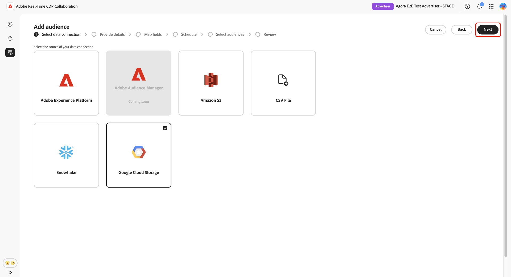

# Configuration des [!DNL Google Cloud Storage] pour l’approvisionnement des audiences

Suivez les étapes de ce guide pour connecter votre compartiment [!DNL Google Cloud Storage] (GCS) à Adobe Real-Time CDP Collaboration et commencer à sourcer les données d’audience propriétaires via l’interface utilisateur.

Connectez un compartiment GCS à Collaboration pour ingérer directement des données d’audience propriétaires sans assistance technique. Une fois connecté, Collaboration extrait les audiences de votre compartiment selon un planning récurrent et les rend disponibles pour l’activation et l’analyse de chevauchement dans vos projets de collaboration. L’approvisionnement de vos audiences est une étape obligatoire avant de pouvoir les activer ou de les utiliser dans une analyse de chevauchement avec des collaborateurs.

Ce guide couvre le workflow de configuration de bout en bout : préparation des conditions préalables, authentification de votre compartiment GCS, révision des champs d’identité mappés automatiquement, planification de l’actualisation des données et confirmation que l’approvisionnement s’est terminé avec succès.

Les audiences provenant de [!DNL Google Cloud Storage] suivent les mêmes règles de gouvernance et de gestion des données que les audiences provenant de Adobe Experience Platform.

D’autres méthodes de source disponibles incluent , [Amazon S3](./configure-aws-s3-audience-sourcing.md), [Snowflake](./configure-snowflake-audience-sourcing.md) et [le chargement de fichier CSV](./upload-csv-audience-sourcing.md).

## Conditions préalables {#prerequisites}

Terminez tous les éléments de cette section avant de démarrer le workflow de configuration. Les prérequis incomplets sont la raison la plus courante de l’échec de la configuration ou de l’absence d’audiences après sourcing. Avant de suivre ce guide, vous devez avoir terminé [intégration et configuration du compte](./onboard-account.md).

Certaines étapes de cette section nécessitent l’intervention d’un administrateur [!DNL Google Cloud]. Si vous n’êtes pas l’administrateur [!DNL Google Cloud] de votre organisation, identifiez la personne appropriée avant de commencer.

### Accès et autorisations GCS {#gcs-access-permissions}

Avant de poursuivre, vérifiez les points suivants auprès de votre administrateur [!DNL Google Cloud] :

* Adobe a reçu les autorisations requises pour s’authentifier par rapport à votre compartiment GCS et lire les fichiers d’audience. Pour obtenir des instructions détaillées, reportez-vous à la section [configuration des autorisations](#setup-gcs-permissions).
* [!DNL Google Cloud Storage]’approvisionnement des audiences est disponible dans votre région. La disponibilité varie selon les régions (NA, EMEA, ANZ). Si l’approvisionnement GCS n’est pas encore disponible dans votre région, contactez votre représentant de compte Adobe pour confirmer un calendrier.

### Préparation des données d’audience {#prepare-audience-data}

Vos fichiers d’audience doivent être conformes à la **[Spécification d’approvisionnement de l’audience (v1.3)](../../assets/quick-start/RTCDP_Collaboration_Audience_Sourcing_Spec_v1_3.pdf)** avant que l’approvisionnement ne commence. Consultez la spécification pour la définition de schéma complète et les exemples au niveau du champ. Les principales exigences sont les suivantes :

* **Format de fichier :** CSV, en utilisant des virgules comme délimiteurs de champ et des barres verticales (`|`) comme séparateurs pour plusieurs valeurs dans un seul champ.
* **Champs obligatoires :** chaque enregistrement doit inclure une colonne `AUDIENCE_ID` et au moins une colonne clé de correspondance prise en charge.
* **Clés de correspondance prises en charge :** `HASHED_EMAIL_SHA_256`, `HASHED_PHONE_SHA_256`, `HASHED_IPV4_SHA_256`, `CRM_ID`, `LOYALTY_ID`, `ADFIXUS_ID`.
* **Exigences de hachage :** toutes les valeurs de clé correspondantes doivent être tronquées, mises en minuscules et hachées SHA256 avant le chargement. Collaboration ne hache ni ne normalise les données avant l’ingestion.
* **Cohérence des colonnes :** si votre compartiment contient plusieurs fichiers d’audience, tous les fichiers doivent utiliser des structures de colonnes identiques.

Toutes les clés de correspondance présentes dans vos fichiers d’audience doivent également être activées pour votre compte Collaboration. Pour ajouter ou activer des clés de correspondance, voir [Configurer des clés de correspondance](./onboard-account.md#set-up-match-keys).

### Valeurs requises avant de commencer {#required-values}

Préparez les valeurs suivantes avant de démarrer l’assistant de configuration.

| Valeur | Description |
| --- | --- |
| **[!UICONTROL compartiment]** | Nom du compartiment [!DNL Google Cloud Storage] contenant vos fichiers d’audience. |
| **[!UICONTROL Chemin]** | Préfixe de chemin d’accès dans le compartiment où vos fichiers d’audience sont stockés (par exemple, `sourcing/testdata/path1/`). |

## Configurer votre connexion [!DNL Google Cloud Storage] {#configure-gcs-connection}

Le workflow de configuration est un assistant à plusieurs étapes dans l’espace de travail **[!UICONTROL Configuration]**. Effectuez chaque étape dans l’ordre. Vous pouvez revenir à n’importe quelle étape à l’aide de l’icône en forme de crayon sur l’écran de révision final avant de créer la connexion.

### Ajouter une nouvelle connexion de données {#add-data-connection}

Dans l’onglet **[!UICONTROL Mes audiences]** de l’espace de travail **[!UICONTROL Configuration]**, sélectionnez l’icône d’ajout () puis sélectionnez **[!UICONTROL Audience]**.

S’il s’agit de votre première audience, vous pouvez également sélectionner l’option **[!UICONTROL Ajouter]**.

Le workflow Ajouter une audience s’affiche. Sélectionnez **[!UICONTROL Ajouter une nouvelle connexion de données]** puis sélectionnez **[!UICONTROL Suivant]**.

{zoomable="yes"}

### Sélectionner [!DNL Google Cloud Storage] comme source de données {#select-gcs}

>[!CONTEXTUALHELP]
>id="rtcdp_collaboration_audience_sourcing_specifications_gcs"
>title="Préparer vos données pour l’intégration"
>abstract="Lisez le guide de spécification de l’approvisionnement d’audience pour savoir comment formater et structurer les données d’audience à partir de Google Cloud Storage pour Collaboration."
>additional-url="https://www.adobe.com/go/rtcdp-collaboration-audience-sourcing" text="Voir le guide Spécification d’approvisionnement de l’audience"

L’écran de sélection de la source de données répertorie tous les types de connexion disponibles. Sélectionnez **[!UICONTROL Google Cloud Storage]** puis sélectionnez **[!UICONTROL Suivant]**.

Une boîte de dialogue prérequise décrivant les étapes de configuration requises (par exemple, la configuration du compartiment GCS et l’affectation de rôle IAM) s’affiche et indique que les données doivent être conformes à la **[[!UICONTROL Spécification d’approvisionnement d’audience]](../../assets/quick-start/RTCDP_Collaboration_Audience_Sourcing_Spec_v1_3.pdf)**. Sélectionnez **[!UICONTROL Démarrer l’intégration]** pour confirmer la conformité avant de continuer.

### Saisir les détails de votre connexion [!DNL Google Cloud Storage] {#authenticate-gcs-connection}

>[!CONTEXTUALHELP]
>id="rtcdp_collaboration_audience_sourcing_gcs"
>title="Ajouter une audience depuis Google Cloud Storage"
>abstract="Pour connecter votre Google Cloud Storage, autorisez l’utilisateur ou l’utilisatrice du service Adobe à récupérer les données de votre audience pour traitement. Suivez les étapes décrites dans Experience League pour accorder à Adobe l’accès à votre Google Cloud Storage."

Fournissez les détails requis pour permettre à Collaboration d’accéder à votre compartiment [!DNL Google Cloud Storage]. Après avoir saisi les informations requises, sélectionnez **[!UICONTROL Suivant]**.

| Champ | Description |
| --- | --- |
| **[!UICONTROL compartiment]** | Nom de votre compartiment [!DNL Google Cloud Storage]. Voir [Valeurs requises avant de commencer](#required-values). |
| **[!UICONTROL Chemin]** | Préfixe de chemin d’accès dans le compartiment où vos fichiers d’audience sont stockés. |

### Confirmer le consentement et la confirmation d’utilisation des données {#confirm-consent}

Vous devez confirmer que les désinscriptions au consentement ont été supprimées des données d’audience avant que Collaboration puisse les traiter. Si vous ne savez pas si vos données répondent à cette exigence, consultez le guide [politique de gouvernance et mesures d’application](./onboard-audiences.md#governance-policy-and-enforcement-actions) avant de continuer. Cochez la case de confirmation, puis sélectionnez **[!UICONTROL OK]** pour continuer.

### Fournir les détails de la connexion {#provide-connection-details}

Saisissez un nom et une description facultative pour cette connexion de données. Le nom que vous indiquez apparaît dans l’onglet **[!UICONTROL Mes connexions de données]** et permet de distinguer cette source si vous gérez plusieurs connexions de données.

* **[!UICONTROL Nom de la connexion de données]** (obligatoire)
* **[!UICONTROL Description de la connexion de données]** (facultatif).

Sélectionnez **[!UICONTROL Suivant]** pour continuer.

### Vérifier les champs d’identité mappés automatiquement {#auto-mapped-fields}

L’écran **[!UICONTROL Mappage]** est en lecture seule. Collaboration mappe automatiquement les champs d’identité source de vos fichiers d’audience aux champs cibles en fonction des noms de colonne définis dans la spécification d’origine d’audience . À ce stade, vous ne pouvez pas ajouter, supprimer ou appliquer de transformations aux champs mappés.

>[!TIP]
>
>Sélectionnez **[!UICONTROL Prévisualiser les données sources]** pour passer en revue un échantillon des données de votre audience au format tabulaire, puis sélectionnez **[!UICONTROL Fermer]** pour revenir à l’écran de mappage.

{zoomable="yes"}

Vérifiez que les mappages affichés reflètent les champs de vos fichiers d’audience. Dans le cas contraire, arrêtez et corrigez vos fichiers pour qu’ils soient conformes à la [Spécification d’approvisionnement de l’audience](../../assets/quick-start/RTCDP_Collaboration_Audience_Sourcing_Spec_v1_3.pdf) avant de continuer. Sélectionnez **[!UICONTROL Suivant]** pour continuer.

### Planifier l’actualisation des données {#schedule-data-refresh}

Dans la vue **[!UICONTROL Planifier]**, définissez la fréquence à laquelle Collaboration récupère les données d’audience mises à jour de votre intervalle GCS et définissez la période active pour l’approvisionnement.

Utilisez le menu déroulant **[!UICONTROL Fréquence]** pour sélectionner la fréquence à laquelle Collaboration récupère les données d’audience mises à jour de votre compartiment GCS. Les intervalles disponibles vont de **[!UICONTROL quotidien]** à **[!UICONTROL tous les 6 jours]**.

Saisissez une période dans le champ de saisie ou sélectionnez l&#39;icône de calendrier pour définir la **[!UICONTROL date de début]** et la **[!UICONTROL date de fin]** pour la période d&#39;origine active. Lorsque la date de fin est atteinte, le sourcing cesse et les audiences précédemment sourcées expirent et ne sont plus disponibles pour une utilisation dans les projets de collaboration.

>[!IMPORTANT]
>
>Définissez la fréquence d’actualisation pour qu’elle corresponde ou ne dépasse pas le taux de mise à jour de vos données d’audience GCS sous-jacentes. L’intervalle d’actualisation minimum pris en charge est d’une fois tous les six jours. Une actualisation plus fréquente que les modifications de données consomme des crédits Collaboration sans produire de résultats mis à jour. Pour surveiller votre utilisation du crédit, voir [Suivre votre activité de consommation du crédit](./my-activity.md).

Sélectionnez **[!UICONTROL Suivant]** pour continuer.

### Vérifier et terminer la connexion {#review-and-complete}

Consultez le résumé de la configuration avant de créer la connexion. L’écran de résumé affiche les sections suivantes :

* **[!UICONTROL Connexion aux données]** : informations d’identification du compartiment GCS et chemin d’accès au dossier que vous avez configuré.
* **[!UICONTROL Détails]** : le nom et la description facultative de cette connexion de données.
* **[!UICONTROL Mapping]** : champs d’identité source et cible mappés automatiquement.
* **[!UICONTROL Planification]** : fréquence d’actualisation et période active.

Sélectionnez l’icône en forme de crayon () en regard d’une section pour revenir à cette étape et apporter des modifications. Lorsque toutes les sections sont correctes, sélectionnez **[!UICONTROL Terminer]**.

Une boîte de dialogue de confirmation s’affiche, indiquant que Collaboration a créé la connexion de données et que l’approvisionnement de l’audience est en cours.

## Vérifier les audiences sources {#review-sourced-audiences}

Une fois que vous avez terminé l’assistant de configuration, Collaboration commence à sourcer les audiences de votre compartiment GCS de manière asynchrone. Accédez à **[!UICONTROL Configuration]** > **[!UICONTROL Mes audiences]** pour surveiller la progression. L’approvisionnement ne se termine pas immédiatement ; le temps requis dépend de la taille de vos données et de la fréquence d’actualisation configurée.

### Surveiller la progression de l’approvisionnement des audiences {#monitor-sourcing-progress}

Pendant que Collaboration récupère vos données d’audience, une bannière en haut de l’espace de travail **[!UICONTROL Mes audiences]** indique que le sourcing est en cours. Les audiences individuelles apparaissent dans la liste uniquement une fois l’approvisionnement terminé pour chaque audience.

>[!TIP]
>
>Le temps d’approvisionnement de l’audience varie en fonction de la taille de vos données GCS et de la fréquence d’actualisation que vous avez configurée. L’affichage de jeux de données plus volumineux ou de plannings d’actualisation moins fréquents peut prendre plus de temps dans l’espace de travail **[!UICONTROL Mes audiences]**.

### Afficher les détails de l’audience source {#view-audience-details}

Une fois le sourcing terminé, vos audiences [!DNL Google Cloud Storage] apparaissent dans l’onglet **[!UICONTROL Mes audiences]** à côté des audiences provenant d’autres connexions. Sélectionnez un élément de ligne ou **[!UICONTROL Afficher l’audience]** pour ouvrir la vue détaillée d’une audience spécifique.

La vue détaillée affiche le statut de l’audience, la source et le nom de la connexion aux données, ainsi que les panneaux suivants :

* **[!UICONTROL Identités]** : nombre total d’identités et répartition de l’audience, une fois que les données sont disponibles.
* **[!UICONTROL Catégories]** : toutes les balises appliquées pour organiser ou filtrer l’audience.
* **[!UICONTROL Accès de connexion]** : indique si l’audience est privée, publique ou partagée avec des collaborateurs spécifiques.
* **[!UICONTROL Visibilité des métadonnées]** : informations sur l’audience telles que le nombre d’identités, le pourcentage de chevauchement et l’index, visibles par les collaborateurs.

.

Consultez ces paramètres avant d’utiliser l’audience dans un projet de collaboration. Pour mettre à jour les catégories, l’accès aux connexions ou la visibilité des métadonnées, consultez [Affichage et gestion des audiences individuelles](./onboard-audiences.md#view-individual-audiences).

### Modifier les paramètres d’audience {#edit-audience-settings}

Vous pouvez modifier les métadonnées d’audience directement à partir de la vue liste **[!UICONTROL Mes audiences]** sans ouvrir la vue détaillée. Cochez la case d’une audience pour afficher la barre d’outils d’actions, puis sélectionnez une action : **[!UICONTROL Modifier la visibilité des métadonnées]**, **[!UICONTROL Modifier l’accès à la connexion]**, **[!UICONTROL Modifier le nom et la description]**, **[!UICONTROL Modifier les catégories]** ou **[!UICONTROL Supprimer]**.

### Affichage de la connexion aux données GCS {#view-gcs-connection}

Pour vérifier ou gérer la connexion elle-même, y compris ses clés de correspondance et sa planification, accédez à **[!UICONTROL Configuration]** > **[!UICONTROL Mes connexions de données]**. Votre nouvelle connexion GCS y est immédiatement disponible. La source de l’audience s’affiche sous la forme **[!UICONTROL Google Cloud Storage]**.

## Limites connues {#known-limitations}

Tenez compte des contraintes suivantes lors de la configuration et de l’utilisation de l’approvisionnement des audiences [!DNL Google Cloud Storage] :

* **Contraintes de clé de correspondance :** une fois qu’une clé de correspondance est activée pour une connexion de données, elle ne peut pas être supprimée. Vous pouvez ajouter des clés de correspondance à une connexion existante, mais vous ne pouvez pas les désactiver ni les supprimer. Pour modifier les clés de correspondance actives, vous devez [supprimer la connexion de données](./manage-data-connection.md#delete-data-connection) et en créer une nouvelle.
* **Une connexion de données active par source :** une seule connexion de données [!DNL Google Cloud Storage] active est prise en charge à la fois. Si vous devez sourcer des audiences à partir d’un autre compartiment, [supprimez la connexion existante](./manage-data-connection.md#delete-data-connection) et créez-en une qui pointe vers le nouveau compartiment.
* **Prise en charge des sous-dossiers :** les fichiers d’audience doivent se trouver directement dans le chemin d’accès au dossier spécifié. Collaboration ne parcourt pas les sous-dossiers de ce chemin d’accès.

## Dépannage {#troubleshooting}

Utilisez cette section pour résoudre les problèmes qui se produisent après l’établissement de la connexion initiale. Pour les erreurs qui se produisent pendant l’authentification, vérifiez vos informations d’identification et vos autorisations de compartiment ou contactez votre administrateur.

**Les audiences n’apparaissent pas ou l’approvisionnement prend plus de temps que prévu**

* La durée de l’approvisionnement est fonction du volume des données et de la fréquence d’actualisation configurée. Un temps de traitement étendu est attendu pour les jeux de données volumineux.
* Si les audiences ne se sont pas affichées dans les 24 heures, vérifiez que les fichiers d’audience existent dans le chemin de dossier spécifié lors de la configuration et qu’ils sont conformes aux spécifications d’approvisionnement des audiences.
* Vérifiez l’onglet **[!UICONTROL Mes connexions de données]** pour connaître les indicateurs d’erreur sur la connexion.
* Si le problème persiste après avoir suivi ces étapes, contactez l’assistance clientèle d’Adobe et fournissez le nom de la connexion de données et les détails du compartiment.

**La connexion de données affiche le statut En échec après le succès initial**

* Vérifiez que les autorisations et informations d’identification de l’intervalle GCS n’ont pas changé depuis que vous avez créé la connexion. Toute modification qui supprime l’accès d’Adobe au compartiment entraîne l’échec des exécutions de sourcing suivantes.
* Vérifiez que les fichiers d’audience existent toujours au niveau du chemin d’accès au dossier configuré et sont conformes aux spécifications d’approvisionnement de l’audience.
* Si le problème persiste après avoir confirmé les autorisations et la disponibilité des fichiers, [supprimez la connexion](./manage-data-connection.md#delete-data-connection) et créez-en une nouvelle, ou contactez l’assistance clientèle d’Adobe.

**Des erreurs de format de fichier d’audience se produisent lors d’une actualisation planifiée**

* Vérifiez que les fichiers mis à jour dans l’intervalle sont conformes à la structure des colonnes et aux exigences des champs dans la [Spécification d’origine d’audience](../../assets/quick-start/RTCDP_Collaboration_Audience_Sourcing_Spec_v1_3.pdf).
* Assurez-vous que tous les fichiers du chemin d’accès au dossier configuré utilisent des structures de colonnes identiques. Des fichiers de formats différents situés dans le même chemin d’accès peuvent provoquer des échecs de sourcing partiel.

## Configurer les autorisations [!DNL Google Cloud Storage] {#setup-gcs-permissions}

[!DNL Google Cloud Storage] offre un moyen sécurisé et évolutif de stocker vos données et d’y accéder dans le cloud. Pour permettre à Adobe de lire à partir de vos compartiments GCS, vous devez configurer les autorisations IAM (Identity and Access Management) appropriées et l’accès au compte de service dans votre compte [!DNL Google Cloud].

### Collecter des informations sur les [!DNL Google Service Account] d’Adobe {#collect-account-information}

Pour commencer, notez les [!DNL Google Service Account] d’Adobe correspondant à votre région. Vous aurez besoin de ces informations pour accorder l’accès à Adobe aux étapes suivantes.

| Région | [!DNL Google Service Account] |
| ------------- | --------------- |
| Amérique du Nord | `kk9930000@va3-22da.iam.gserviceaccount.com` |
| EMEA | `kze830000@sfc-eufrankfurt-1-g4a.iam.gserviceaccount.com` |
| Australie | `knhv20000@sfc-au-1-nla.iam.gserviceaccount.com` |

{style="table-layout:auto"}

### Configurer le rôle IAM {#setup-iam-role}

>[!IMPORTANT]
>
>Pour effectuer cette configuration, vous devez disposer des privilèges **Administrateur de compte** dans votre compte [!DNL Google Cloud]. Si vous ne disposez pas de ces privilèges, contactez votre administrateur avant de continuer.

Suivez les étapes ci-dessous pour créer un rôle IAM personnalisé avec les autorisations nécessaires et l’affecter au compte de service Adobe. Adobe dispose ainsi d’un accès sécurisé aux données de votre audience GCS.

#### Créer un rôle IAM {#create-iam-role}

Tout d’abord, créez un rôle IAM personnalisé dans votre projet [!DNL Google Cloud] avec les autorisations nécessaires à attribuer à Adobe.

Dans la page **[!DNL IAM & Admin]** de la [[!DNL Google Cloud] Console](https://console.cloud.google.com), accédez à **[!DNL Roles]** et sélectionnez **[!DNL Create role]**. Renseignez les informations requises telles que le titre et l’identifiant de votre nouveau rôle.

Ajoutez ensuite les autorisations suivantes au rôle :

| Autorisation | Rôle |
| ------------- | --------------- |
| `storage.buckets.get` | Lire les métadonnées du compartiment. |
| `storage.objects.get` | Lire des données et des métadonnées d’objet. |
| `storage.objects.list` | Répertorier les objets dans un compartiment. |

{style="table-layout:auto"}

Pour plus d’informations sur les autorisations, voir [ Autorisations GCS IAM ](https://cloud.google.com/storage/docs/access-control/iam-permissions). Pour obtenir des instructions détaillées, voir [comment créer des rôles personnalisés](https://docs.cloud.google.com/iam/docs/creating-custom-roles).

#### Affectation d’un rôle IAM à Adobe {#assign-role}

Ouvrez ensuite la page de ](https://console.cloud.google.com/storage/browser) dans le [!DNL Google Cloud Console] et sélectionnez le compartiment qui contient les données de votre audience.[**[!DNL Buckets]**

Accédez à l’onglet **[!DNL Permissions]**, choisissez **[!DNL View by principals]**, puis sélectionnez **[!DNL Grant access]**.

Dans la boîte de dialogue **[!DNL Add principals]**, ajoutez le compte de service Adobe Google  en tant qu’entité principale et attribuez le rôle IAM personnalisé que vous avez créé précédemment. Sélectionnez **[!DNL Save]** pour confirmer la configuration.

Adobe dispose désormais d’un accès sécurisé aux données de votre audience dans le compartiment GCS sélectionné. Passez en revue les [conditions préalables](#prerequisites) supplémentaires si nécessaire ou passez à [commencez à approvisionner les audiences de GCS dans Collaboration](#configure-gcs-connection).

#### Collecter les détails du [!DNL Google Cloud Storage] {#collect-gcs-details}

Enfin, collectez les détails de votre compartiment SCG comme indiqué dans le tableau ci-dessous. Vous aurez besoin de ces informations pour configurer la connexion entre votre GCS et Collaboration.

| Champ | Description | Exemple |
|------ |------------ |-------- |
| [!DNL Bucket] | Nom exact du compartiment [!DNL Google Cloud Storage] contenant vos fichiers d’audience. | `customer-data-bucket` |
| [!DNL Path] | Préfixe de chemin d’accès dans le compartiment où vos fichiers d’audience sont stockés. Doit se terminer par `/` pour lire tous les fichiers. | `sourcing/testdata/path1/` |

{style="table-layout:auto"}

## Étapes suivantes {#next-steps}

Vous avez configuré [!DNL Google Cloud Storage] comme source de données dans Collaboration. Une fois l’approvisionnement terminé, vos audiences sont disponibles dans l’espace de travail **[!UICONTROL Mes audiences]** et prêtes à être utilisées dans des projets de collaboration.

Plusieurs possibilités sʼoffrent alors à vous :

* [Créer et gérer des projets de collaboration](../collaborate/manage-projects.md)
* [Activer des audiences dans un projet](../collaborate/activate.md)
* [Vérifier les chevauchements et mesurer les performances](../collaborate/measure.md)
* [Gérer les paramètres et la visibilité de l’audience](./onboard-audiences.md#view-individual-audiences)
* [Gérer les clés de correspondance et le planning de cette connexion de données](./manage-data-connection.md)

Pour d’autres méthodes d’approvisionnement d’audience, voir :

* [Configurer  [!DNL Amazon S3]  pour le sourcing d’audience](./configure-aws-s3-audience-sourcing.md)
* [Configurer  [!DNL Snowflake]  pour le sourcing d’audience](./configure-snowflake-audience-sourcing.md)
* [Audiences Source à partir d’Experience Platform](./onboard-audiences.md)
* [Chargement d’un fichier CSV pour l’audience](./upload-csv-audience-sourcing.md)
