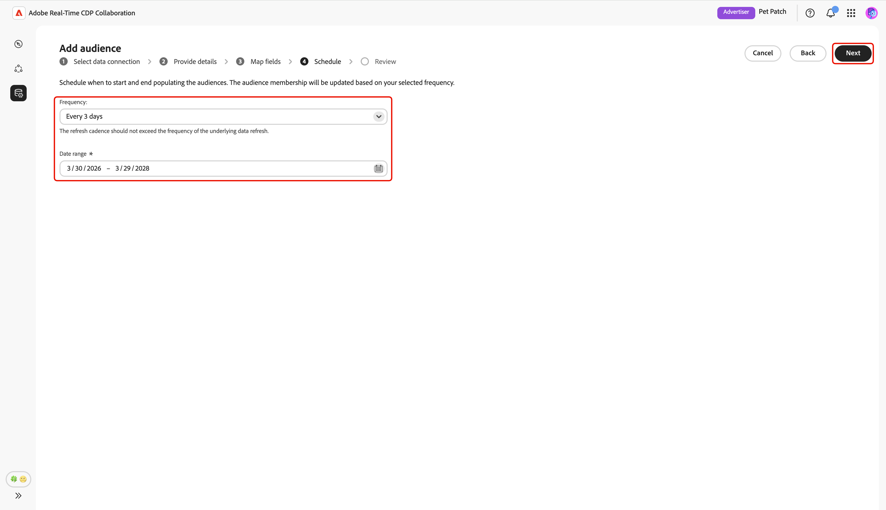
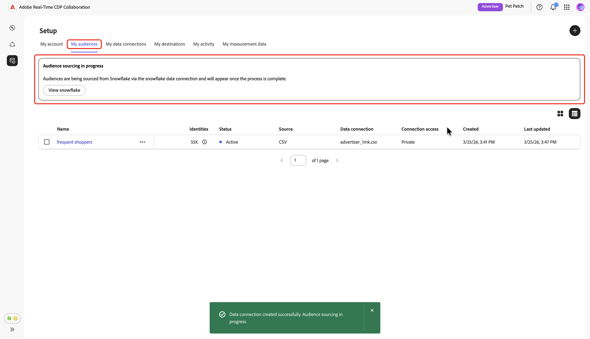

# Configuration des [!DNL Snowflake] pour l’approvisionnement des audiences

Découvrez comment configurer et connecter vos [!DNL Snowflake Secure Data Share] dans l’interface utilisateur d’Adobe Real-Time CDP Collaboration aux données de l’audience source pour l’activation et l’analyse de chevauchement.

## Vue d’ensemble {#overview}

[!DNL Snowflake] est l’une des options prises en charge pour l’approvisionnement des données d’audience propriétaires dans Collaboration. D’autres méthodes disponibles incluent l’approvisionnement des audiences à partir de [&#128279;](./onboard-audiences.md), la connexion d’un [[!DNL AWS S3] compartiment](./configure-aws-s3-audience-sourcing.md) ou le chargement d’un fichier [CSV](./upload-csv-audience-sourcing.md).

Suivez les étapes ci-dessous pour connecter votre [!DNL Snowflake Secure Data Share] et générer les données de votre audience dans Collaboration. Une fois la configuration terminée, vous pouvez vérifier, activer et gérer vos audiences sources pour vos projets de collaboration.

## Conditions préalables {#prerequisites}

Avant de configurer votre connexion [!DNL Snowflake], veillez à respecter les conditions préalables suivantes :

* Vous avez créé un [!DNL Snowflake Share] et configuré les autorisations nécessaires dans votre compte [!DNL Snowflake] pour accorder à Adobe l’accès à votre [!DNL Snowflake Secure Data Share].
* Les valeurs [!DNL Snowflake Share] suivantes sont prêtes :

   * **Nom du partage**
   * **Identifiant du compte**
   * **Schéma**
   * **Vue**

* Les données d’audience de votre [!DNL Snowflake Secure Data Share] doivent respecter les exigences de format décrites dans le guide [Spécification d’approvisionnement de l’audience (v1.2)](../../assets/quick-start/RTCDP_Collaboration_Audience_Sourcing_Spec_v1.2.pdf) .
* Toutes les clés de correspondance de votre fichier d’audience [!DNL Snowflake] doivent également être activées pour votre compte Collaboration. Découvrez comment [activer les clés de correspondance](./onboard-account.md#set-up-match-keys) ou [ajouter de nouvelles clés de correspondance](./onboard-account.md#edit-match-keys) à votre compte.

## Configurer votre connexion [!DNL Snowflake] {#configure-snowflake-connection}

Dans l’onglet **[!UICONTROL Mes audiences]** de l’espace de travail **[!UICONTROL Configuration]**, sélectionnez l’icône d’ajout () puis sélectionnez **[!UICONTROL Audience]**.

S’il s’agit de votre première audience, vous pouvez également sélectionner l’option **[!UICONTROL Ajouter une audience]**.

Le workflow Ajouter une audience s’affiche. Sélectionnez **[!UICONTROL Ajouter une nouvelle connexion de données]** puis sélectionnez **[!UICONTROL Suivant]**.

{zoomable="yes"}

### Sélectionnez [!DNL Snowflake] comme connexion de données {#select-snowflake}

Ensuite, sélectionnez **&#x200B;**&#x200B;comme connexion de données, puis **[!UICONTROL Suivant]**.

![Écran de sélection de la connexion aux données avec [!DNL Snowflake] disponible sous la forme d’une option sélectionnable.](../../assets/setup/snowflake-audience-sourcing/select-snowflake-data-connection.png)

### Vérifier le fichier d’audience {#review-audience-file}

>[!CONTEXTUALHELP]
>id="rtcdp_collaboration_audience_sourcing_specifications_snowflake"
>title="Préparer vos données pour l’intégration"
>abstract="Lisez le Guide de spécification d’approvisionnement d’audience pour savoir comment formater et structurer les données d’audience à partir de Snowflake pour Collaboration."
>additional-url="https://www.adobe.com/go/rtcdp-collaboration-audience-sourcing" text="Voir le guide"

Une boîte de dialogue s’affiche, expliquant les exigences du [!DNL Snowflake Share] et du fichier d’audience [!DNL Snowflake] avant de commencer le sourcing. Assurez-vous que votre [!DNL Snowflake Share] est créé avec le nom de partage, l’identifiant de compte, le schéma et la vue corrects. Pour vérifier que les données de votre audience sont formatées et structurées correctement pour une utilisation dans Collaboration, consultez le guide **[[!UICONTROL Spécification d’approvisionnement de l’audience]](../../assets/quick-start/RTCDP_Collaboration_Audience_Sourcing_Spec_v1.2.pdf)**.

Une fois l’intégration terminée, sélectionnez **[!UICONTROL Commencer]**.

![Préparez votre [!DNL Snowflake Share] pour la boîte de dialogue d’intégration avec un lien vers les spécifications d’approvisionnement des audiences.](../../assets/setup/snowflake-audience-sourcing/prepare-snowflake-share-onboarding-dialog.png)

### Authentifier la connexion [!DNL Snowflake Share] {#authenticate-snowflake-share-connection}

Au cours de cette étape, vous devez fournir les informations d’identification [!DNL Snowflake Share] requises pour connecter votre [!DNL Snowflake Share] à Collaboration :

| Champ | Description | Exemple |
|--------------------|-------------|------------------------------|
| Partager le nom | Nom de votre [!DNL Snowflake Share]. | `ADOBE_DATA_SHARE` |
| Identifiant de compte | Identifiant unique de votre compte Snowflake. | `CUSTOMER_ORG.CUSTOMER_SNOWFLAKE_ACCOUNT` |
| Schéma | Le schéma de votre [!DNL Snowflake Share] qui contient les données de votre audience. | `CUSTOMER_SCHEMA` |
| Affichage | Le jeu de données réel que Collaboration extrait dans les données d’audience. | `SECURE_VIEW_FOR_ADOBE` |

{style="table-layout:auto"}

Après avoir saisi toutes les informations d’identification requises, sélectionnez **[!UICONTROL Suivant]**.

![Formulaire de connexion [!DNL Snowflake Share] avec les champs Nom de partage, Identifiant de compte, Schéma et Affichage remplis, et le bouton Suivant mis en surbrillance.](../../assets/setup/snowflake-audience-sourcing/snowflake-authentication-credentials-form.png)

Une boîte de dialogue de confirmation s’affiche au bas de la page suivante, confirmant que votre [!DNL Snowflake Share] a bien été connecté à Collaboration.

![Une boîte de dialogue de confirmation confirme que votre connexion [!DNL Snowflake Share] a bien été établie.](../../assets/setup/snowflake-audience-sourcing/snowflake-share-connection-established.png)

### Indiquer le nom et la description {#provide-name-description}

Dans la vue **[!UICONTROL Fournir des détails]**, saisissez un nom explicite et une description facultative pour votre connexion aux données [!DNL Snowflake]. Lorsque vous avez terminé, sélectionnez **[!UICONTROL Suivant]**.

### Champs de mappage {#map-fields}

L’écran **[!UICONTROL Mappage]** est en lecture seule pour le moment. Vous ne pouvez pas ajouter, supprimer ou appliquer de transformations. Collaboration mappe automatiquement les champs d’identité source de vos données [!DNL Snowflake Share] aux champs cibles en fonction de la **[Spécification d’approvisionnement d’audience (v1.2)](../../assets/quick-start/RTCDP_Collaboration_Audience_Sourcing_Spec_v1.2.pdf)**.

Confirmez visuellement les champs mappés et sélectionnez **[!UICONTROL Suivant]** pour continuer. Vous pouvez également prévisualiser un exemple de données à partir de votre [!DNL Snowflake Share] à l’aide de l’option **[!UICONTROL Prévisualiser les données sources]**.

Lorsque vous choisissez de prévisualiser, la boîte de dialogue **[!UICONTROL [!DNL Snowflake Share]l’aperçu des données]** s’affiche avec un exemple de données sous la forme d’un tableau. Vérifiez ceci, puis sélectionnez **[!UICONTROL Fermer]**.

![[!DNL Snowflake Share] boîte de dialogue d’aperçu des données affiche les exemples de données de votre [!DNL Snowflake Share] et l’option Fermer mise en surbrillance.](../../assets/setup/snowflake-audience-sourcing/preview-source-data.png)

<!-- NOTE: Manual mapping will be available in the future. -->
<!-- In the **[!UICONTROL Map fields]** screen, you can use the **[!UICONTROL Source field]** and **[!UICONTROL Target field]** dropdowns to update the auto-mapped fields, or include additional fields with the **[!UICONTROL Add field]** option. Once finished, select **[!UICONTROL Next]**. -->

<!--  -->

### Planifier la fréquence d’actualisation et la période {#refresh-frequency-date-range}

Ensuite, dans la vue **[!UICONTROL Planification]**, utilisez le menu déroulant pour sélectionner la fréquence d’actualisation entre un et six jours. Utilisez ensuite l’icône de calendrier pour spécifier les dates de début et de fin de l’audience de sourcing.

>[!IMPORTANT]
>
>Pour gérer efficacement vos crédits Collaboration, définissez la fréquence d’actualisation pour qu’elle corresponde ou ne dépasse pas la fréquence de mise à jour de vos données [!DNL Snowflake] sous-jacentes. L’intervalle d’actualisation minimum pris en charge est d’une fois tous les six jours.

### Vérifier et terminer la connexion {#review-and-complete}

Enfin, passez en revue vos paramètres de configuration dans l’écran de résumé. Cette vue contient un résumé des sections suivantes :

* **[!UICONTROL Connexion aux données]** : affiche le nom du partage, l’identifiant de compte, le schéma et la vue de votre [!DNL Snowflake Share].
* **[!UICONTROL Détails]** : affiche le nom et la description facultative de votre connexion de données pour vous aider à l’identifier ultérieurement.
* **[!UICONTROL Mappage]** : affiche la manière dont les champs sources du fichier d’audience sont mappés aux champs cibles utilisés dans Collaboration.
* **[!UICONTROL Planification]** : affiche la fréquence à laquelle la connexion actualise les données d’audience et la période active pour l’approvisionnement.

Sélectionnez l’icône en forme de crayon () si vous devez modifier une section. Sélectionnez **[!UICONTROL Terminé]** pour confirmer toutes les sections.

Une boîte de dialogue de confirmation confirme que la connexion de données a été créée avec succès et que l’audience est en cours de sourcing.

## Vérifier les audiences sources {#review-sourced-audiences}

Une fois la configuration terminée, Collaboration commence à sourcer les audiences à partir de votre [!DNL Snowflake Share]. Si le sourcing d’audience est en cours, une bannière s’affiche en haut de la vue.

>[!TIP]
>
>Le temps d’approvisionnement de l’audience varie en fonction de la taille des données [!DNL Snowflake] et de la fréquence d’actualisation que vous avez configurée. L’affichage de jeux de données plus volumineux ou de plannings d’actualisation moins fréquents peut prendre plus de temps dans l’espace de travail **[!UICONTROL Mes audiences]**.

Une fois le sourcing terminé, vos audiences sont disponibles dans l’onglet **[!UICONTROL Mes audiences]** avec les mêmes fonctionnalités et informations que les audiences provenant d’Experience Platform.

En mode Grille ou Tableau, sélectionnez un élément de ligne ou **[!UICONTROL Afficher l’audience]** pour afficher un aperçu d’une audience spécifique. Elle affiche le statut, la source et le nom de la connexion de données de l’audience, ainsi que des panneaux détaillés pour **[!UICONTROL Identités]**, **[!UICONTROL Catégories]**, **[!UICONTROL Accès à la connexion]** et **[!UICONTROL Visibilité des métadonnées]**. Pour plus d’informations[&#128279;](./onboard-audiences.md#view-individual-audiences) consultez la section Comment afficher une audience individuelle) .

Utilisez cette vue pour confirmer les paramètres de configuration et de visibilité de l’audience avant d’utiliser l’audience dans des projets de collaboration.

## Afficher la connexion aux données [!DNL Snowflake] {#view-snowflake-connection}

La nouvelle connexion [!DNL Snowflake] est immédiatement disponible dans l’onglet **[!UICONTROL Mes connexions de données]**. La source de l’audience s’affiche sous la forme [!UICONTROL [!DNL Snowflake]].

Votre connexion de données [!DNL Snowflake] inclut les mêmes fonctionnalités et détails que les autres connexions de données d’audience. En savoir plus sur [comment afficher et gérer les connexions de données](../setup/manage-data-connection.md).

![L’onglet Mes connexions de données affiche la connexion de données [!DNL Snowflake] avec les informations de statut de sourcing.](../../assets/setup/snowflake-audience-sourcing/data-connection-tab-snowflake.png)

## Étapes suivantes {#next-steps}

Vous avez maintenant correctement configuré et connecté votre [!DNL Snowflake] en tant que source de données dans Collaboration. Une fois l’approvisionnement terminé, vous pouvez [créer des projets de collaboration](../collaborate/manage-projects.md), [activer les audiences](../collaborate/activate.md), [examiner les chevauchements et les informations](../collaborate/measure.md) et [gérer les paramètres et la visibilité de votre audience](./onboard-audiences.md).

Pour plus d’informations sur les autres méthodes d’approvisionnement d’audience, consultez les documentations suivantes :

* [Configurer  [!DNL Amazon S3]  pour le sourcing d’audience](./configure-aws-s3-audience-sourcing.md)
* [Audiences Source à partir d’Experience Platform](./onboard-audiences.md)
* [Charger un fichier CSV pour l’audience](./upload-csv-audience-sourcing.md)
