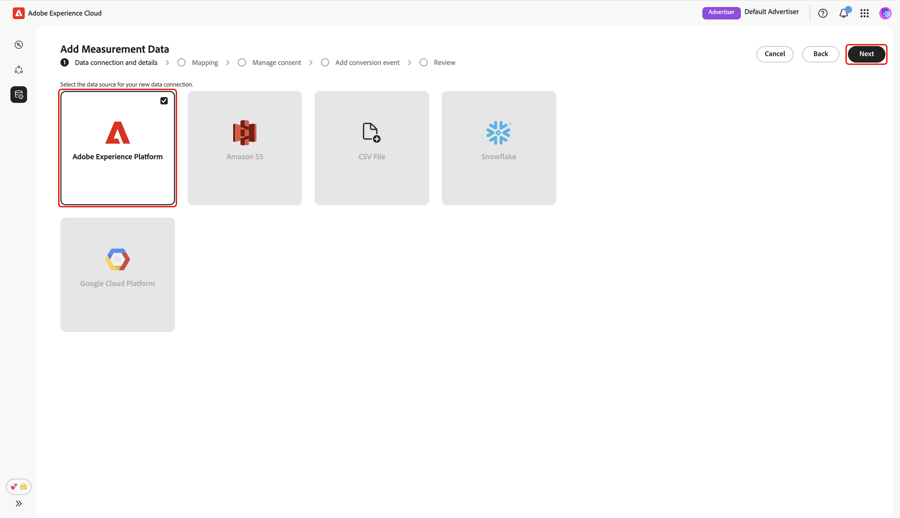
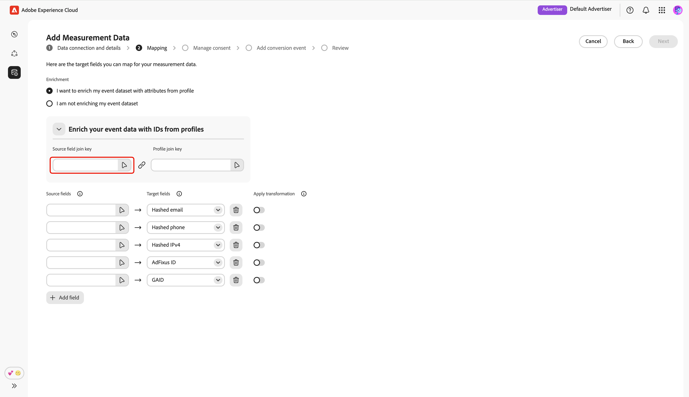
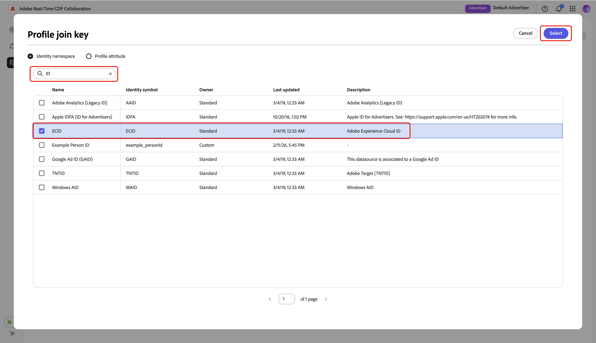
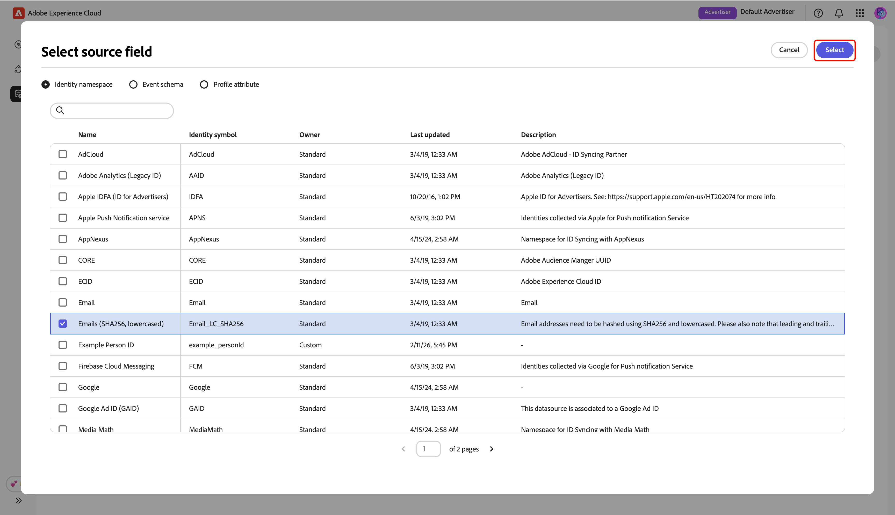
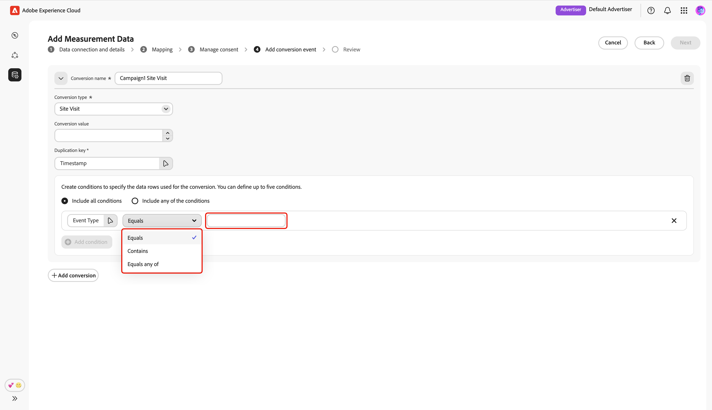

# Ajouter et gérer des données de mesure {#add-and-manage-measurement-data}

>[!CONTEXTUALHELP]
>id="rtcdp_collaboration_onboard_measurement_data"
>title="En savoir plus"
>abstract=""

>[!CONTEXTUALHELP]
>id="rtcdp_collaboration_measurement_data_target_fields"
>title="Champs cibles"
>abstract="Espace réservé pour les champs cibles de mesure."

>[!CONTEXTUALHELP]
>id="rtcdp_collaboration_measurement_data_source_fields"
>title="Champs sources"
>abstract="Espace réservé pour les champs sources de mesure."

>[!CONTEXTUALHELP]
>id="rtcdp_collaboration_import_measurement_mapping_source_fields"
>title="Champs sources de mapping"
>abstract="Espace réservé pour les champs sources de mapping de mesure."

>[!CONTEXTUALHELP]
>id="rtcdp_collaboration_import_measurement_mapping_target_fields"
>title="Champs cibles de mapping"
>abstract="Espace réservé pour les champs cibles de mapping de mesure."

{{limited-availability-release-note}}

Ce document décrit les étapes à suivre pour ajouter des données de mesure de campagne à Adobe Real-Time CDP Collaboration. Les éditeurs peuvent collaborer avec les équipes d’Adobe pour charger les données de mesure des campagnes. Une fois les données chargées et traitées, l’éditeur et l’annonceur pourront afficher des rapports de mesure de campagne [campaign](/help/guide/collaborate/measure.md) complets.

## Ajouter des données de mesure {#add-measurement-data}

En tant qu’annonceur, vous pouvez charger vos données de mesure contenant des événements de conversion vers Collaboration pour les utiliser dans des rapports de mesure de campagne. Les données de conversion comprennent généralement des champs tels que les identifiants d’utilisateur (par exemple, des e-mails ou des identifiants d’appareil hachés), l’horodatage de l’événement de conversion et des détails spécifiques à l’événement de conversion, tels que l’achat ou l’inscription.

Pour générer des données de mesure, accédez à l’onglet **[!UICONTROL Mes données de mesure]** dans l’espace de travail **[!UICONTROL Configuration]**. Sélectionnez l’icône d’ajout () puis sélectionnez **[!UICONTROL Données de mesure]**.

S&#39;il s&#39;agit de vos premières données de mesure, vous pouvez également sélectionner l&#39;option **[!UICONTROL Ajouter]**.

{zoomable="yes"}

L’écran **[!UICONTROL Ajouter des données de mesure]** s’affiche, affichant un résumé des étapes pour générer les données de mesure. Sélectionnez **[!UICONTROL Démarrer l’intégration]**.

{zoomable="yes"}

### Détails et connexion de données {#data-connection-and-details}

Au cours de cette étape, vous devez configurer votre connexion de données et spécifier les détails de vos données de mesure.

#### Sélectionner le type de données de mesure {#select-measurement-data-type}

Le type de données de mesure définit le type d’événements que vous importez pour la mesure de la campagne. Actuellement, le type de données de conversion est pris en charge.

Sélectionnez **[!UICONTROL Données de conversion]** comme type de données de mesure, suivi de **[!UICONTROL Suivant]**.

{zoomable="yes"}.

#### Sélectionner la connexion de données {#select-data-connection}

Une connexion aux données est la source à partir de laquelle vous récupérez les données de mesure dans Collaboration. Une fois que vous avez établi votre connexion de données initiale et sourcé votre premier jeu de données de mesure, vous pouvez continuer à sourcer des données de mesure supplémentaires en utilisant la même connexion de données.

Pour ajouter une connexion de données, sélectionnez **[!UICONTROL Ajouter une nouvelle connexion de données]**, puis sélectionnez **[!UICONTROL Suivant]**.

{zoomable="yes"}.

#### Sélectionner une source de données {#select-data-source}

Choisissez ensuite la source de votre connexion aux données. Actuellement, Adobe Experience Platform est la seule source de données prise en charge.

Sélectionnez votre source de données, puis sélectionnez **[!UICONTROL Suivant]**.

{zoomable="yes"}.

#### Sélectionner un sandbox {#select-sandbox}

Sélectionnez le sandbox qui inclut les données de mesure que vous souhaitez utiliser pour les rapports de mesure de campagne Collaboration. Sélectionnez le sandbox dans la liste des sandbox disponibles, puis sélectionnez **[!UICONTROL Suivant]**.

{zoomable="yes"}.

#### Sélectionner un jeu de données de mesure {#select-measurement-dataset}

Une liste de jeux de données dans le sandbox sélectionné s’affiche. Sélectionnez un jeu de données comme données de mesure, puis sélectionnez **[!UICONTROL Suivant]**. Vous pouvez utiliser l’option Rechercher pour filtrer et trouver le jeu de données préféré.

{zoomable="yes"}.

#### Indiquer le nom et les détails {#provide-name-and-details}

Indiquez ensuite un nom et une description pour votre connexion de données. Ces informations vous aideront à identifier la connexion de données ultérieurement.

{zoomable="yes"}

### Mappage {#mapping}

L’étape suivante consiste à mapper les champs de vos données de mesure aux champs cibles correspondants utilisés dans Collaboration. Vous pouvez également choisir d’enrichir votre jeu de données d’événement avec des attributs du profil client en temps réel en mappant les clés de jointure et en utilisant ces attributs pour ventiler les rapports de mesure.

#### Enrichissement des données d’événement {#enrich-event-data}

Pour enrichir vos données d’événement, sélectionnez l’option Clé de jointure de champ **[!UICONTROL Source]**.

{zoomable="yes"}

Dans la boîte de dialogue Clé de jointure de champ **&#x200B;**&#x200B;choisissez le champ source, puis **[!UICONTROL Sélectionner]**.

{zoomable="yes"}

Sélectionnez ensuite l’option **[!UICONTROL Clé de jointure du profil]**. Dans la boîte de dialogue **[!UICONTROL Clé de jointure du profil]**, sélectionnez le champ de profil dans la liste. Vous pouvez utiliser l’option Rechercher pour trouver le champ souhaité. Sélectionnez ensuite **[!UICONTROL Sélectionner]** pour confirmer.

{zoomable="yes"}.

#### Champs de mappage {#mapping-fields}

Pour commencer à mapper les champs source de vos données de mesure aux champs cibles dans Collaboration, sélectionnez le champ source vide dans l’écran **[!UICONTROL Mappage]**.

{zoomable="yes"}

La boîte de dialogue **[!UICONTROL Sélectionner le champ source]** s’affiche. Elle présente une liste des champs source disponibles regroupés sous des options telles que **[!UICONTROL Espace de noms d’identité]** et **[!UICONTROL Schéma d’événement]**. Vous pouvez utiliser l’option de recherche pour filtrer et trouver le champ source dans la liste.

Choisissez le champ source de votre choix, puis **[!UICONTROL Sélectionner]**.

{zoomable="yes"}.

Utilisez ensuite le menu déroulant pour mapper le champ source sélectionné à un champ cible approprié. Tous les champs cibles disponibles sont les clés [correspondance configurées pour votre compte collaborateur](./onboard-account.md#set-up-match-keys).

{zoomable="yes"}

Vous pouvez ajouter ou supprimer des lignes de mappage, si nécessaire. Si vous devez mapper un champ source non haché à un champ cible haché (par exemple, mapper un e-mail en texte brut à [!UICONTROL e-mail haché]), utilisez l’option **[!UICONTROL Appliquer la transformation]** pour appliquer le hachage requis.

Une fois que vous avez terminé, passez en revue les champs mappés et les clés de jointure si l’enrichissement est activé. Sélectionnez ensuite **[!UICONTROL Suivant]**.

{zoomable="yes"}

### Gérer le consentement {#manage-consent}

Avant de poursuivre, vous devez reconnaître que l’utilisation des données dans Collaboration est conforme à vos politiques de gouvernance des données de Real-Time CDP. Toutes les données doivent être préfiltrées en fonction des exigences de consentement ou des politiques de consentement personnalisées applicables, de sorte qu’aucun traitement supplémentaire n’est nécessaire.

Pour confirmer l’accusé de réception, sélectionnez **[!UICONTROL Suivant]**.

{zoomable="yes"}

Si vous [activez l’enrichissement du profil lors de l’étape de mappage](#enrich-event-data), vous pouvez configurer des politiques de consentement à partir d’une liste d’options prédéfinies. Cela inclut :

* **Actions marketing** : utilisez ces actions marketing pour contrôler les données d’audience à importer dans Collaboration à partir d’Experience Platform.
* **Règles de consentement** : sélectionnez les règles de consentement à appliquer aux données provenant de Collaboration.
* **Audience** : utilisez le filtre d’audience pour inclure ou exclure des profils d’audience pour le consentement.

>[!NOTE]
>
>**[!UICONTROL Data Collaboration]** prend en charge les libellés d’utilisation des données C4, C5 et C9, tandis que **[!UICONTROL Data Science]** prend uniquement en charge C9. Consultez la documentation d’Experience Platform pour en savoir plus sur les libellés d’utilisation des données :
>
>* [Présentation des libellés d’utilisation des données](https://experienceleague.adobe.com/fr/docs/experience-platform/data-governance/labels/overview){target="_blank"}
>* [Glossaire](https://experienceleague.adobe.com/fr/docs/experience-platform/data-governance/labels/reference){target="_blank"}

Sélectionnez les paramètres souhaités, puis sélectionnez **[!UICONTROL Suivant]**.

{zoomable="yes"}

Avant de poursuivre, vous devez confirmer et accepter les termes de la boîte de dialogue **[!UICONTROL Politique de gouvernance et mesures d’application]**. Cochez la case, puis **[!UICONTROL OK]**.

{zoomable="yes"}

#### Filtre d’audience {#audience-filter}

Pour inclure ou exclure certains profils d’audience pour le consentement, utilisez le menu déroulant **[!UICONTROL Filtre d’audience]**. Une fois que vous avez sélectionné ce filtre, l’interface utilisateur se met à jour pour afficher l’option **[!UICONTROL Parcourir les audiences]**. Sélectionnez **[!UICONTROL Parcourir les audiences]**.

{zoomable="yes"}

La boîte de dialogue **[!UICONTROL Sélectionner des audiences]** s’affiche. Choisissez une audience dans la liste, puis **[!UICONTROL Sélectionner]**.

{zoomable="yes"}.

L’audience choisie s’affiche maintenant et vous avez la possibilité de la supprimer si nécessaire. Vérifiez vos paramètres de consentement, puis sélectionnez **[!UICONTROL Suivant]**.

{zoomable="yes"}.

### Ajouter un événement de conversion {#add-conversion-event}

Définissez ensuite les événements de conversion dont vous souhaitez mesurer l’impact de vos campagnes, par exemple, sur les visites de site, les inscriptions ou les achats terminés. Vous pouvez spécifier jusqu’à **3** événements de conversion distincts pour la mesure.

Indiquez le nom de l’événement de conversion, puis utilisez le menu déroulant pour sélectionner le type de conversion.

{zoomable="yes"}

Vous pouvez saisir une valeur pour la conversion ou la laisser vide si vous ne souhaitez pas attribuer de valeur pour le moment.

{zoomable="yes"}

Ensuite, vous devez spécifier la clé de duplication pour indiquer quelles lignes de votre jeu de données d’événement appartiennent au même événement de conversion sous-jacent (par exemple, le même horodatage pendant un processus d’inscription). Cela évite de compter la même conversion plusieurs fois dans les rapports de mesure. Pour ce faire, sélectionnez **[!UICONTROL Clé de duplication]**. Dans la boîte de dialogue **[!UICONTROL Clé de duplication]**, recherchez et choisissez la clé, puis **[!UICONTROL Sélectionner]**.

{zoomable="yes"}

Après avoir spécifié la clé de duplication, vous pouvez ajouter jusqu’à **5** conditions pour inclure uniquement les lignes pertinentes du jeu de données d’événement pour la conversion. Choisissez d’appliquer l’ensemble ou l’une de ces conditions.

Sélectionnez **[!UICONTROL Ajouter une condition]**, puis sélectionnez l’option de condition.

{zoomable="yes"}

Dans la boîte de dialogue **[!UICONTROL Sélectionner le champ source]**, recherchez et choisissez un champ source pour la règle de condition, suivi de **[!UICONTROL Sélectionner]**.

{zoomable="yes"}.

Utilisez le menu déroulant pour sélectionner un opérateur logique, puis saisissez la valeur de la règle de configuration.

{zoomable="yes"}

Pour ajouter un autre événement de conversion, sélectionnez **[!UICONTROL Ajouter une conversion]**. Vous pouvez inclure jusqu’à 3 **&#x200B;**&#x200B;d’événements de conversion au total. Une fois l’opération terminée, passez en revue les configurations de conversion et sélectionnez **[!UICONTROL Suivant]**.

{zoomable="yes"}

### Réviser {#review}

L&#39;écran **[!UICONTROL Révision]** s&#39;affiche avec un résumé des paramètres des données de mesure. Vérifiez que toutes les informations sont correctes. Si vous devez modifier une section, utilisez l’option **[!UICONTROL Modifier]**.

Enfin, sélectionnez **[!UICONTROL Terminé]** pour terminer l’ajout des données de mesure.

{zoomable="yes"}

Une boîte de dialogue de confirmation confirme la création réussie de vos données de mesure. Vous pouvez voir les nouveaux événements de conversion configurés à partir de vos données de mesure dans l’espace de travail **[!UICONTROL Mes données de mesure]**.

{zoomable="yes"}

En mode Grille ou Tableau, sélectionnez un élément de ligne ou l’option **[!UICONTROL Afficher la conversion]** dans une carte d’événement pour afficher un aperçu d’un événement de conversion spécifique. Il affiche le statut de l’événement, la source et le nom de la connexion de données, ainsi que des panneaux détaillés pour :

* **[!UICONTROL Détails de la conversion]** : affiche des informations clés sur la conversion, y compris son type, la clé de duplication utilisée pour identifier les événements uniques et la valeur de conversion affectée (si spécifiée).
* **[!UICONTROL Conditions]** : affiche les règles de condition appliquées à cet événement de conversion.

{zoomable="yes"}

## Modifier les données de mesure {#edit-measurement-data}

Après avoir sourcé vos données de mesure, vous pouvez modifier les détails et les règles de condition d’un événement de conversion à tout moment.

Dans l’onglet **[!UICONTROL Mes données de mesure]**, sélectionnez l’option représentant des points de suspension () dans la vignette d’événement de conversion appropriée. Sélectionnez ensuite **[!UICONTROL Afficher la conversion]** dans le menu déroulant pour ouvrir la page détaillée de cet événement de conversion.

{zoomable="yes"}

### Modifier le nom et la description {#edit-name-and-description}

Pour mettre à jour le nom et la description de l’événement, sélectionnez l’icône Modifier () en haut à droite de la page.

{zoomable="yes"}

Dans la boîte de dialogue **[!UICONTROL Modifier le nom et la description]**, mettez à jour les champs avec les valeurs souhaitées, puis sélectionnez **[!UICONTROL Enregistrer]** pour appliquer vos modifications.

{zoomable="yes"}

Une boîte de dialogue de confirmation s’affiche pour confirmer que les détails ont bien été mis à jour.

### Modifier les détails de la conversion {#edit-conversion-details}

Vous pouvez mettre à jour les détails de conversion suivants de l’événement :

| Champ | Description |
|-------------------|-------------|
| Type de conversion | La catégorie de l’événement de conversion, telle qu’une visite du site, un achat ou une inscription. |
| Clé de duplication | Identifiant des lignes du jeu de données d’événement appartenant au même événement de conversion (par exemple, même date et heure). Empêche les doublons. |
| Valeur de conversion | Valeur associée à chaque conversion. |

{style="table-layout:auto"}

Pour commencer la modification, sélectionnez **[!UICONTROL Modifier]** dans le panneau **[!UICONTROL Détails de la conversion]**.

{zoomable="yes"}

Dans la boîte de dialogue **[!UICONTROL Modifier les détails de conversion]**, utilisez le menu déroulant pour mettre à jour le type de conversion. Vous pouvez saisir une valeur pour la conversion ou la laisser vide si vous ne souhaitez pas lui attribuer de valeur. Pour modifier la clé de duplication, sélectionnez l’option Clé existante .

{zoomable="yes"}

La boîte de dialogue **[!UICONTROL Clé de duplication]** affiche une liste des champs disponibles regroupés sous des options telles que **[!UICONTROL Espace de noms d’identité]** et **[!UICONTROL Schéma d’événement]**. Recherchez et choisissez la touche souhaitée, puis **[!UICONTROL Sélectionner]**.

{zoomable="yes"}

Une fois l’opération terminée, passez en revue les mises à jour et sélectionnez **[!UICONTROL Enregistrer]** pour appliquer les modifications.

{zoomable="yes"}

Une boîte de dialogue de confirmation s’affiche pour confirmer que les détails ont bien été mis à jour.

### Modifier les conditions {#edit-conditions}

Les règles de condition spécifient les lignes de données de votre jeu de données d’événement incluses en tant que conversions. Mettez à jour ces règles selon les besoins pour vous assurer que votre mesure reflète uniquement les données les plus pertinentes pour votre analyse.

Pour modifier des conditions, sélectionnez **[!UICONTROL Modifier]** dans le panneau **[!UICONTROL Conditions]**.

{zoomable="yes"}

Dans la boîte de dialogue **[!UICONTROL Modifier les règles de conversion]**, vous pouvez afficher les détails actuels de toutes les conditions. Sélectionnez une option de condition existante pour mettre à jour ses détails, y compris le champ source, la règle logique et la valeur.

{zoomable="yes"}

Pour inclure des règles de conversion supplémentaires, sélectionnez **[!UICONTROL Ajouter une condition]**. Sélectionnez ensuite l’option Nouvelle condition vide .

{zoomable="yes"}

Dans la boîte de dialogue **[!UICONTROL Sélectionner le champ source]**, vous pouvez voir les champs disponibles regroupés sous des options telles que **[!UICONTROL Espace de noms d’identité]** et **[!UICONTROL Schéma d’événement]**. Sélectionnez le champ approprié à utiliser pour votre condition, puis choisissez **[!UICONTROL Sélectionner]**. Vous pouvez utiliser l’option **[!UICONTROL Rechercher]** pour trouver rapidement le champ de votre choix.

{zoomable="yes"}.

Ensuite, utilisez le menu déroulant pour sélectionner un opérateur logique dans la liste disponible et saisissez une valeur pour la condition.

{zoomable="yes"}

Utilisez **[!UICONTROL Inclure toutes les conditions]** si toutes les conditions spécifiées sont requises pour chaque conversion, ou utilisez **[!UICONTROL Inclure n’importe laquelle des conditions]** pour autoriser les conversions qui correspondent à au moins une condition. Une fois la mise à jour terminée, vérifiez et sélectionnez **[!UICONTROL Enregistrer]** pour appliquer les modifications.

{zoomable="yes"}

Une boîte de dialogue de confirmation s’affiche pour confirmer que les détails ont bien été mis à jour.

## Suppression des données de mesure {#delete-measurement-data}

La suppression des données de mesure supprime définitivement de votre projet l’événement de conversion associé et tous les détails de mesure liés. Les rapports de mesure qui reposent sur cet événement perdront les mesures de conversion correspondantes et ne pourront plus être mis à jour. Cette action ne peut pas être annulée.

Pour supprimer un événement de conversion existant, accédez à l’onglet **[!UICONTROL Mes données de mesure]** dans l’espace de travail **[!UICONTROL Configuration]**. En mode Grille, sélectionnez **[!UICONTROL Supprimer]** dans la vignette d’événement appropriée. En mode Tableau, sélectionnez l’icône de suppression () à côté du nom de l’événement.

{zoomable="yes"}

La boîte de dialogue **[!UICONTROL Supprimer la mesure]** s’affiche et vous invite à confirmer la suppression de l’événement. Sélectionnez **[!UICONTROL Supprimer]**.

{zoomable="yes"}

Une boîte de dialogue de confirmation s’affiche pour confirmer que l’événement de conversion a bien été supprimé.

## Étapes suivantes {#next-steps}

Vous avez terminé l’approvisionnement de vos données de mesure dans Collaboration. En tant qu’annonceur, vous pouvez désormais créer des rapports d’attribution pour découvrir comment vos campagnes génèrent des conversions et mesurent l’impact global. Si vous êtes un éditeur, demandez à votre collaborateur de générer un rapport d’attribution pour vos campagnes. Pour obtenir des instructions détaillées, consultez le guide [Créer un rapport d’attribution](../collaborate/measure.md#create-attribution-report).
