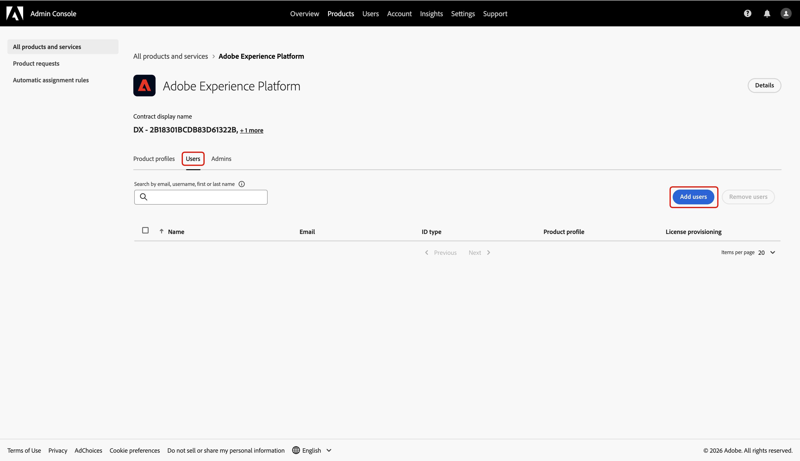

# Configuration de l’accès administrateur pour l’intégration à Collaboration [!DNL Starter]

En tant que premier utilisateur de votre entreprise à accéder à Adobe Experience Platform via Collaboration [!DNL Starter], vous êtes responsable de la configuration et de la gestion de l’accès pour votre équipe. Vous devez vous accorder les autorisations administrateur et utilisateur nécessaires pour commencer à travailler dans Real-Time CDP Collaboration. Lisez ce guide pour savoir comment configurer l’accès requis dans Admin Console afin de pouvoir gérer les autorisations pour les collaborations dans l’interface Autorisations .

## Conditions préalables {#prerequisites}

Avant de poursuivre, vérifiez que vous disposez des éléments suivants :

* A accepté l’invitation de votre partenaire Collaboration sous licence. Pour plus d&#39;informations sur les exigences relatives aux invitations, consultez la [présentation  [!DNL Starter]  Collaboration](../overview/starter-overview.md#prerequisites).
* Vous avez examiné et signé les conditions générales de Collaboration.
* Réception de votre e-mail de bienvenue Adobe et finalisation de la création de votre premier compte .

## Configurer l’accès {#setup-access}

Lorsque votre compte Adobe est créé par le biais du workflow [!DNL Starter], le rôle d’administrateur système vous est automatiquement attribué. Vous pouvez ainsi gérer les utilisateurs et les accès aux produits dans Admin Console. Cependant, vous n’avez pas encore accès aux **[!UICONTROL autorisations]**, qui sont requises pour gérer l’accès pour Collaboration.

Utilisez Admin Console pour vous accorder à la fois **accès administrateur de produit** à Experience Platform et **accès utilisateur** aux produits Experience Platform afin d’accéder à **[!UICONTROL autorisations]**.

Pour en savoir plus sur les rôles et les produits dans Experience Cloud, consultez la documentation [présentation du contrôle d’accès](../permissions/overview.md).

>[!TIP]
>
>Tout au long de ce guide, un **administrateur** se réfère à **administrateurs système et administrateurs de produit**.

### Configuration de l’accès administrateur de produit {#configure-product-admin-access}

Lisez cette section pour vous accorder des privilèges d’administrateur afin de commencer à configurer l’accès à Collaboration [!DNL Starter].

#### Accès à Admin Console {#access-admin-console}

Pour commencer, connectez-vous à [&#128279;](https://experience.adobe.com/){target="_blank"} avec vos informations d&#39;identification. Vous pouvez voir une liste de vos produits disponibles dans la section **[!UICONTROL Accès rapide]**. Sélectionnez lʼ&#x200B;**[!UICONTROL Admin Console]**.

{zoomable="yes"}

#### Accès au tableau de bord du produit Adobe Experience Platform {#access-adobe-experience-platform}

L’espace de travail [&#128279;](https://adminconsole.adobe.com/) s’ouvre dans un nouvel onglet. Sélectionnez **&#x200B;**&#x200B;dans la liste **[!UICONTROL Produits]** sous **[!UICONTROL Produits et services]**.

{zoomable="yes"}

#### Ajouter un administrateur de produit {#add-product-admin}

Dans le tableau de bord du produit **&#x200B;**, accédez à l’onglet **[!UICONTROL Admins]**. Sélectionnez ensuite **[!UICONTROL Ajouter un administrateur]**.

Tableau de bord du produit {zoomable="yes"}

Saisissez votre adresse e-mail ou votre nom d’utilisateur dans la boîte de dialogue **[!UICONTROL Ajouter des administrateurs de produit]**, puis sélectionnez le compte approprié dans la liste déroulante. Lorsque vous avez terminé, sélectionnez **[!UICONTROL Enregistrer]**.

{zoomable="yes"}

Vous êtes désormais un administrateur de produit et pouvez ajouter des utilisateurs ou d’autres administrateurs au produit dans Admin Console. Ensuite, accordez-vous un accès utilisateur au produit Experience Platform pour accéder et exécuter des fonctions dans Autorisations.

### Configurer l’accès utilisateur {#configure-user-access}

Pour gérer les autorisations Collaboration, vous devez disposer d’un **accès utilisateur** au produit en plus d’un accès administrateur. L’accès utilisateur peut être configuré par un administrateur système ou produit.

>[!TIP]
>
>Si vous suivez la section précédente, vous devriez déjà être dans le tableau de bord du produit **&#x200B;**&#x200B;au sein d’Admin Console. Ensuite, passez à [ajoutez-vous en tant qu’utilisateur](#add-user).

Pour commencer à configurer votre accès utilisateur, procédez comme suit :

1. [Accédez à Admin Console depuis la page d’accueil de Adobe Experience Cloud](#access-admin-console).
2. [Accédez au tableau de bord du produit Adobe Experience Platform](#access-adobe-experience-platform).

#### Ajouter un utilisateur au produit {#add-user}

Vous êtes maintenant dans le tableau de bord du produit **&#x200B;**. Accédez à l’onglet **[!UICONTROL Utilisateurs]** puis sélectionnez **[!UICONTROL Ajouter des utilisateurs]**.

Tableau de bord du produit {zoomable="yes"}

La boîte de dialogue **[!UICONTROL Ajouter des utilisateurs à ce produit]** s’affiche et vous invite à saisir votre nom, votre groupe d’utilisateurs ou votre adresse e-mail. Renseignez les valeurs, puis sélectionnez votre compte dans la liste déroulante.

{zoomable="yes"}

Sélectionnez ensuite l’icône d’ajout  sous **[!UICONTROL Produits]**.

Une boîte de dialogue s’affiche avec une liste des [profils de produit](https://helpx.adobe.com/fr/enterprise/using/manage-product-profiles.html) disponibles. Sélectionnez **[!UICONTROL AEP-Default-All-Users]** et **[!UICONTROL Default Production All Access]**. Sélectionnez ensuite **[!UICONTROL Appliquer]**.

{zoomable="yes"}

Enfin, sélectionnez **[!UICONTROL Enregistrer]** pour terminer l’ajout d’un nouvel utilisateur au produit.

{zoomable="yes"}

Une fois que vous disposez d’un accès utilisateur, revenez à [&#128279;](https://experience.adobe.com/){target="_blank"}. Vérifiez que **[!UICONTROL Autorisations]** et **[!UICONTROL Real-Time CDP Collaboration]** sont disponibles sous **[!UICONTROL Accès rapide]**.

Écran d’accueil de {zoomable="yes"}

>[!TIP]
>
>Si **[!UICONTROL Autorisations]** et **[!UICONTROL Real-Time CDP Collaboration]** n’apparaissent pas dans **[!UICONTROL Accès rapide]**, essayez de vous déconnecter puis de vous reconnecter.

## Étapes suivantes {#next-steps}

Vous disposez désormais des autorisations **accès administrateur** et **accès utilisateur** pour saisir des autorisations vous permettant de définir des rôles, d’attribuer des autorisations spécifiques et de gérer l’accès utilisateur pour les fonctionnalités et ressources de Collaboration. Pour obtenir des instructions détaillées, reportez-vous au [Guide des contrôles d’autorisation](./starter-permission-controls.md).
