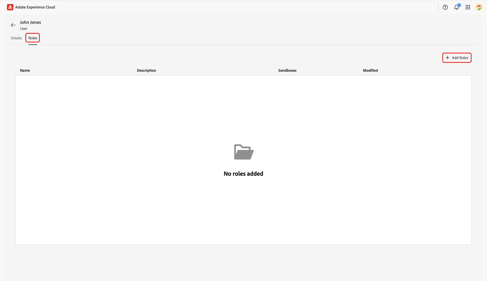

# Configuration des contrôles d’autorisation pour l’intégration à Collaboration [!DNL Starter]

Après avoir configuré l’accès administrateur et utilisateur aux produits Adobe Experience Platform, vous devez vous attribuer des rôles avec les autorisations appropriées pour Real-Time CDP Collaboration. Lisez ce guide pour savoir comment ajouter les rôles appropriés à votre compte via l’interface Autorisations d’Experience Cloud, afin que vous puissiez accéder aux fonctionnalités de Collaboration et les gérer.

Pour plus d’informations sur les rôles standard et les autorisations disponibles inclus dans la ressource Collaboration, consultez le [guide de gestion des rôles](../permissions/manage-roles.md).

## Conditions préalables {#prerequisites}

Assurez-vous de disposer à la fois des **privilèges d’administrateur** et d’un **accès utilisateur** au produit Adobe Experience Platform. Si vous n’avez pas encore configuré ces niveaux d’accès, consultez le [guide d’accès de l’administrateur](./starter-admin-access.md) pour obtenir des instructions détaillées.

## Configuration des autorisations {#setup-permissions}

Suivez les étapes ci-dessous pour configurer les autorisations dont vous avez besoin pour Collaboration. Tout d&#39;abord, connectez-vous à [&#128279;](https://experience.adobe.com/) avec vos informations d&#39;identification.

### Autorisations d’accès {#access-permissions}

Une fois la connexion effectuée, accédez à la section **[!UICONTROL Accès rapide]** et sélectionnez **[!UICONTROL Autorisations]**. Vous accédez alors au tableau de bord Autorisations dans lequel vous pouvez vous attribuer les rôles nécessaires.

{zoomable="yes"}

### Sélectionner un utilisateur {#select-user}

Dans le tableau de bord **[!UICONTROL Autorisations]**, sélectionnez **[!UICONTROL Utilisateurs]** dans le panneau de gauche. Sélectionnez ensuite votre compte dans le tableau Utilisateurs .

>[!NOTE]
>
> Si vous êtes le premier utilisateur de votre entreprise à accéder à Experience Platform, vous pouvez être le seul utilisateur répertorié dans le tableau **Utilisateurs**. Pour inviter d’autres membres de l’équipe, suivez les étapes du [guide de configuration de l’accès utilisateur](../permissions/manage-user-access.md#administrators-configure-user-access-to-experience-platform).

{zoomable="yes"}

### Attribuer des rôles {#assign-roles}

Dans l’espace de travail **[!UICONTROL Utilisateur]** correspondant, accédez à l’onglet **[!UICONTROL Rôles]**. Sélectionnez ensuite **[!UICONTROL Ajouter des rôles]**.

{zoomable="yes"}

La boîte de dialogue **[!UICONTROL Ajouter des rôles]** s’affiche avec un tableau des rôles disponibles. Chaque ligne du tableau représente un rôle avec les informations suivantes :

| **Colonne** | **Description** |
|---------------|--------------------------------------------------------|
| **Nom** | Nom du rôle. |
| **Description** | Bref résumé décrivant la fonction du rôle. Notez que les rôles « lecture seule » ne peuvent pas être personnalisés. |
| **Sandbox** | Spécifie les sandbox (par exemple, `Prod`) auxquels le rôle donne accès. |
| **Modifié** | Date de la dernière mise à jour du rôle. |

{style="table-layout:auto"}

Pour obtenir un aperçu détaillé d’un rôle spécifique et de ses autorisations, consultez le guide [Gérer les autorisations pour un rôle](https://experienceleague.adobe.com/fr/docs/experience-platform/access-control/abac/permissions-ui/permissions).

Passez en revue les informations et sélectionnez les rôles à affecter à votre compte. Lorsque vous avez terminé, sélectionnez **[!UICONTROL Enregistrer]**.

{zoomable="yes"}

Une boîte de dialogue de confirmation confirme que les nouveaux rôles ont bien été ajoutés.

Pour vous assurer que vos autorisations sont correctement configurées, revenez à la page d’accueil [&#128279;](https://experience.adobe.com/). Sélectionnez **&#x200B;**&#x200B;dans **[!UICONTROL Accès rapide]**. Vous devriez être en mesure d’accéder à l’espace de travail Collaboration et de commencer à utiliser les fonctionnalités disponibles pour votre compte [!DNL Starter].

## Étapes suivantes {#next-steps}

Une fois vos autorisations configurées, vous pouvez accéder à Collaboration. Vous pouvez ensuite :

* [Créez des rôles personnalisés avec des autorisations spécifiques pour gérer différents niveaux d’accès](../permissions/manage-roles.md#create-specific-access-roles).
* [Affectez plusieurs utilisateurs à un rôle dans Autorisations](../permissions/manage-user-access.md#assign-a-role).
* [Configurer un compte Collaboration et établir des connexions avec votre collaborateur invité](../overview/starter-overview.md#set-up-connections).
* [En savoir plus sur l’utilisation et la consommation du crédit dans Collaboration [!DNL Starter]](./starter-credit-usage.md).

Pour une présentation complète de Real-Time CDP Collaboration et de ses principales fonctionnalités, consultez le [guide de présentation](../home.md).
