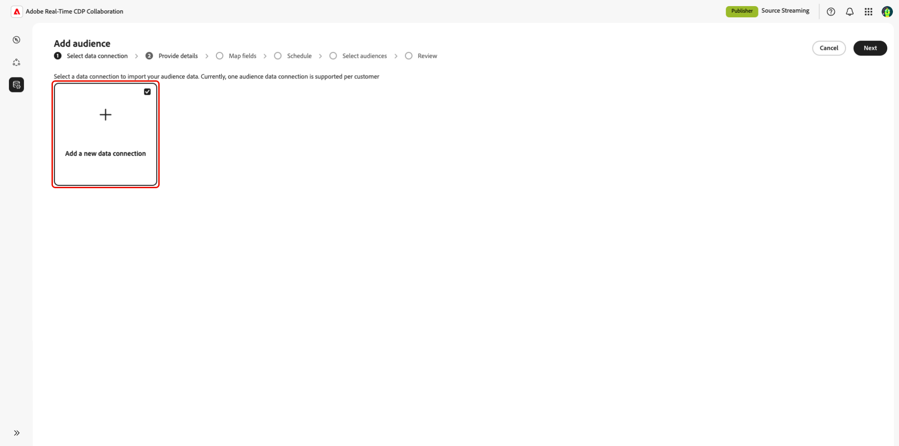
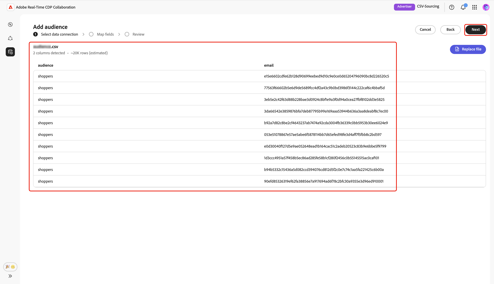
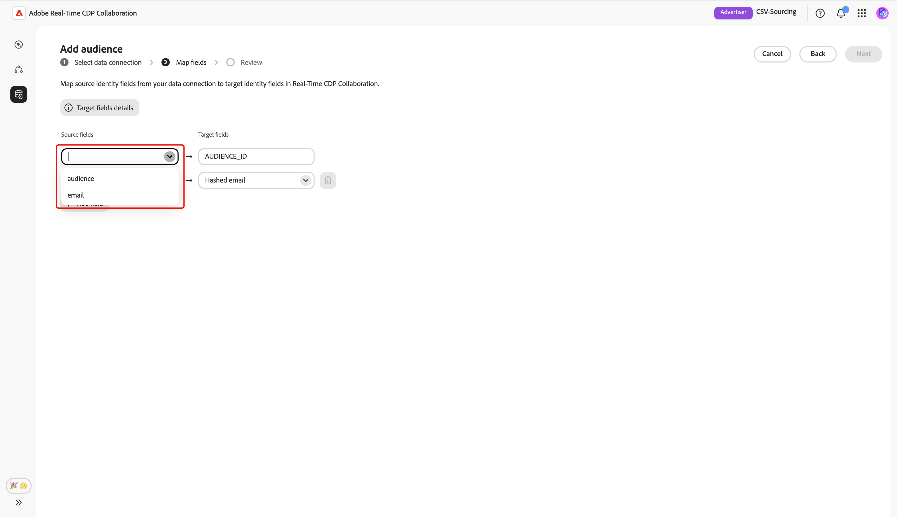
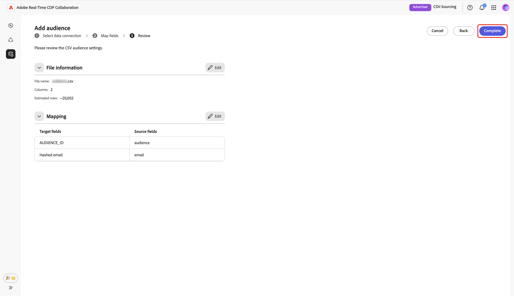

# Charger un fichier CSV pour l’audience

Ce guide décrit les étapes à suivre pour charger un fichier CSV dans l’interface utilisateur d’Adobe Real-Time CDP Collaboration afin de générer les données de votre audience pour les utiliser dans des projets de collaboration.

## Vue d’ensemble {#overview}

Le chargement de fichier CSV est une méthode permettant de générer des données d’audience propriétaires pour des projets de collaboration. Il s’agit d’une alternative à [connexion de votre compartiment AWS S3](./configure-aws-s3-audience-sourcing.md), [connexion de Google Cloud Storage](./configure-gcs-audience-sourcing.md) ou [approvisionnement des audiences à partir d’Experience Platform](./onboard-audiences.md).

Suivez ce workflow pour charger un fichier CSV contenant les données de votre audience dans la source et gérez les audiences propriétaires dans Collaboration. Vous pouvez mapper des champs d’identité pour l’activation et l’analyse de chevauchement. Une fois votre fichier chargé et traité, l’audience source est disponible dans l’espace de travail **[!UICONTROL Mes audiences]**, où vous pouvez vérifier, activer et gérer vos projets de collaboration.

>[!IMPORTANT]
>
>* Les audiences provenant du téléchargement d’un fichier CSV sont disponibles pendant 7 jours ****. Au-delà de cette période, l’audience expire et doit être rechargée pour être utilisée dans vos projets de collaboration.
>
>* Vous pouvez charger un fichier CSV par session à ce stade. Pour ajouter des audiences supplémentaires, effectuez à nouveau le workflow de chargement pour chaque fichier que vous souhaitez approvisionner.

## Conditions préalables {#prerequisites}

Avant de pouvoir charger des fichiers CSV pour l’approvisionnement de l’audience, vérifiez que vous disposez des éléments suivants :

* Intégration du compte terminée dans Real-Time CDP Collaboration. Consultez [Intégration de votre compte](./onboard-account.md) pour obtenir des instructions détaillées.
* Les autorisations nécessaires pour ajouter des audiences dans votre organisation.
* Un fichier CSV contenant les données de votre audience avec des champs d’identité tels que l’e-mail ou le téléphone.

## Chargement d’un fichier CSV {#upload-csv-file}

Dans l’onglet **[!UICONTROL Mes audiences]** de l’espace de travail **[!UICONTROL Configuration]**, sélectionnez l’icône d’ajout () puis sélectionnez **[!UICONTROL Audience]**.

S’il s’agit de votre première audience, vous pouvez également sélectionner l’option **[!UICONTROL Ajouter]**.

Le workflow Ajouter une audience s’affiche. Sélectionnez **[!UICONTROL Ajouter une nouvelle connexion de données]** puis sélectionnez **[!UICONTROL Suivant]**.

{zoomable="yes"}

### Sélectionnez Fichier CSV comme connexion de données {#select-csv-file}

Sélectionnez **[!UICONTROL Fichier CSV]** comme connexion de données, puis **[!UICONTROL Suivant]**.

### Sélectionner un fichier {#select-file}

Choisissez **[!UICONTROL Sélectionner à partir de l’ordinateur]** pour charger un fichier CSV à partir de votre système local. Vous pouvez également faire glisser et déposer le fichier CSV que vous souhaitez charger dans le panneau [!UICONTROL Glisser-déposer un fichier CSV].

>[!IMPORTANT]
>
>Seuls les fichiers CSV sont pris en charge. La taille de fichier maximale est de **2 Go**.

Une fois le chargement effectué, l’interface utilisateur affiche un résumé comprenant le nombre de colonnes, un nombre de lignes estimé, la structure du fichier et un aperçu des 10 premières lignes de données.

Vérifiez le résumé, puis sélectionnez **[!UICONTROL Suivant]**.

#### Remplacer le fichier {#replace-file}

Si vous devez charger un autre fichier CSV, choisissez **[!UICONTROL Remplacer le fichier]** et sélectionnez votre nouveau fichier. L’interface s’actualise ensuite pour afficher un résumé mis à jour des nouvelles données.

Après avoir consulté le résumé révisé, sélectionnez **[!UICONTROL Suivant]**.

### Confirmer l’accusé de réception du consentement {#confirm-consent}

Avant de poursuivre, vous devez reconnaître que les désinscriptions au consentement ont été supprimées de vos données d’audience. Collaboration requiert des données d’audience propres sans utilisateurs qui se sont opposés au partage de données.

Cochez la case de confirmation suivie de **[!UICONTROL OK]** pour confirmer. La boîte de dialogue se ferme alors et vous passez à l’écran de mappage des champs.

### Mapper les champs d’identité source {#map-fields}

Le mappage des champs détermine la manière dont Collaboration utilise les données d’audience pour l’activation et l’analyse de chevauchement. Sur l’écran **[!UICONTROL Mapper les champs]**, utilisez les menus déroulants pour mapper chaque champ d’identité source de votre fichier CSV au champ cible approprié dans Collaboration.

If you need additional details about a target field including the data type or description, select **[!UICONTROL Target fields details]** for more information.

Next, review the mapped fields, and then select **[!UICONTROL Next]**.

### Review and complete the upload {#review-and-complete}

The **[!UICONTROL Review]** screen appears with a summary of the audience settings from your CSV file. Review the information in the following sections:

* **[!UICONTROL File Information]**: Displays the file name, the number of columns, and the estimated row count.
* **[!UICONTROL Mapping]**: Lists how the source fields from your uploaded audience file (for example, `email`) map to target fields used in Collaboration (for example, Hashed email).

Select the pencil icon if you need to edit a section. Select **[!UICONTROL Complete]** to confirm all sections.

A progress bar appears below the summary sections to indicate upload progress. Once the upload completes, a confirmation dialog confirms that your CSV audience was created and audience sourcing is in progress.

## Review sourced audiences {#review-sourced-audiences}

After uploading your CSV file, Collaboration begins sourcing audiences from the file. This process may take several minutes. When the sourcing finishes, your audiences are available in the **[!UICONTROL My Audiences]** tab with the same features and information as audiences sourced from Experience Platform.

When in grid view or table view, select a row item or **[!UICONTROL View audience]** to see an overview of a specific audience. It displays the audience&#39;s status, source, and data connection name, along with detailed panels for:

**[!UICONTROL Identities]**: Displays the total identity count and breakdown once data becomes available.
**[!UICONTROL Categories]**: Displays any tags used for organizing or filtering the audience.
**[!UICONTROL Connection access]**: Displays whether the audience is private, public, or shared with specific collaborators.
**[!UICONTROL Visibilité des métadonnées]** : affiche les informations d’audience (telles que le nombre d’identités, le pourcentage de chevauchement et l’index) visibles par les collaborateurs.

Utilisez cette vue pour confirmer les paramètres de configuration et de visibilité de l’audience avant d’utiliser l’audience dans des projets de collaboration. Pour plus d’informations, voir [Comment afficher une audience individuelle](./onboard-audiences.md#view-individual-audiences).

## Étapes suivantes {#next-steps}

Vous avez chargé votre fichier CSV dans Collaboration. Une fois l’approvisionnement terminé, vous pouvez :

* Créez des projets de collaboration avec vos audiences sources. Voir [Découvrir les audiences](../../guide/collaborate/discover.md).
* Activez les audiences vers des destinations connectées. Voir [ Activer les audiences](../../guide/collaborate/activate.md).
* Examinez les chevauchements et les informations sur les audiences. Voir [Mesure des performances de la campagne](../../guide/collaborate/measure.md).
* Gérez les paramètres et la visibilité de votre audience. Voir [Source et gérer les audiences](./onboard-audiences.md).

Pour plus d’informations sur les autres méthodes de sourcing d’audience, consultez [Configuration d’AWS S3 pour le sourcing d’audience](./configure-aws-s3-audience-sourcing.md) ou [Audiences Source à partir d’Experience Platform](./onboard-audiences.md).
